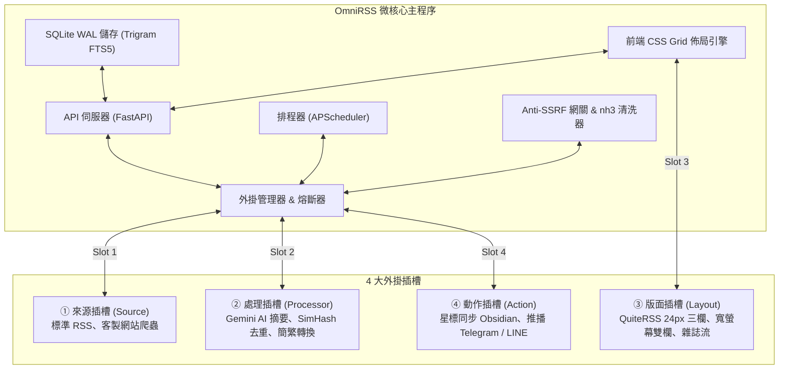

# OmniRSS 🌐

> **微核心 RSS 閱讀器、全文提取與外掛擴充平台**  
> *A self-hosted, microkernel-based RSS reader with a pluggable architecture.*

[](LICENSE)
[](https://www.python.org/)
[](https://fastapi.tiangolo.com/)
[](https://www.sqlite.org/)
[](tests/)

---

## 專案緣起與架構想法

OmniRSS 是為了長時間重度使用 RSS 的開發者所設計的自架閱讀器。核心想法很簡單：**把主程式做小，把擴充性留給外掛。**

主程式只負責排程抓取、資料庫儲存、資安防護與基礎介面；其他各類網站爬蟲、AI 摘要、介面排版或外部同步，全部透過 4 大外掛插槽擴充。



---

## 主要特點

### 1. 網路與內容防護
* **Anti-SSRF 網關**：發送請求前先解析實體 IP，封鎖內網網段與雲端元數據 IP（如 `169.254.169.254`），並透過 Socket Pinning 防止 DNS Rebinding。
* **HTML 靜態清洗**：使用 `nh3` 移除文章內的 `<script>`、`<iframe>` 與 `on*` 事件，搭配 `script-src 'none'` CSP 標頭，防止惡意腳本在閱讀器內執行。
* **外掛故障隔離**：外掛執行逾時強制限制在 1~45 秒內；若連續發生 5 次錯誤會自動熔斷暫停，避免拖垮主程式。

### 2. SQLite 冷熱分離儲存
* **熱資料庫 (`feeds_hot.db`)**：存放近 30~90 天文章中繼資料，單筆約 100 Bytes，搭配 Trigram FTS5 全文索引，支援中英文子字串搜尋。
* **冷存庫 (`archive_cold.db`)**：星標收藏的文章使用 zstd 壓縮保存內文。
* **圖片去重儲存 (`data/images/`)**：圖片自動轉為 WebP 格式並依 SHA-256 雜湊分片存放，避免同一張圖重複下載佔用空間。
* **即時未讀計數**：使用 SQLite 觸發器維護未讀數量，切換分類目錄時不需額外跑 `COUNT(*)` 查詢。

### 3. QuiteRSS 24px 緊湊操作介面
* **單行不折行**：文章列表固定 24px 行高，標題過長自動以省略號截斷（`nowrap` + `ellipsis`）。
* **鍵盤操作**：支援 `J`/`K` 移動、`S` 星標、`M` 標記已讀、`Space` 滾動換頁。
* **動態欄位選單 `[ ⊞ ]`**：可自由勾選顯示標題、作者、時間、標籤等欄位，並支援點擊表頭排序。
* **原生無構建依賴**：採用 ES6 模組與 CSS Grid 變數，不需要 Node.js 打包即可直接運行。

### 4. 爬蟲防阻擋機制
* **475 個訂閱源實測連通率 79.6% ~ 80.6%**（經 OCI 與本地網路驗證）。
* **Auto-Referer 防盜鏈**：自動帶入來源根網域 Referer，解決部分論壇 403 阻擋。
* **三階指紋輪替**：遇到連線異常時，依序切換 `Chrome 128 標頭 ➔ 自動升級 HTTPS ➔ QuiteRSS Qt 指紋`。
* **304 條件請求**：支援 ETag 與 Last-Modified 快取，未更新的頻道不消耗多餘頻寬。

---

## 目錄結構

```text
OmniRSS/
├── locales/                    # 多國語系字典檔 (zh-TW, en-US)
├── src/
│   └── omnirss/                # 核心套件 (src-layout 模式)
│       ├── sdk/                # 外掛開發 SDK (ArticleDTO, BasePlugin, Context)
│       │   ├── models.py
│       │   ├── base_plugin.py
│       │   └── context.py
│       ├── core/               # 核心引擎、儲存底座、資安網關、外掛管理器
│       │   ├── crawler_engine.py   # 高韌性 304 爬蟲引擎與指紋輪替
│       │   ├── database.py         # SQLite WAL 連線池、Trigram FTS5 與觸發器
│       │   ├── rule_engine.py      # QuiteRSS 條件過濾與動作分發規則引擎
│       │   ├── scheduler.py        # 非同步定時排程循環與並行限制
│       │   ├── security.py         # Anti-SSRF 網關、Argon2id 認證與 nh3 清洗
│       │   ├── backup_engine.py    # OPML 2.0 雙向階層備份與設定脫敏
│       │   ├── plugin_manager.py   # 動態外掛載入、設定疊加與熔斷機制
│       │   ├── circuit_breaker.py  # 5 次錯誤自動熔斷保護器
│       │   ├── image_vault.py      # SHA-256 WebP 圖片去重儲存庫
│       │   ├── i18n.py             # 後端多國語系翻譯器
│       │   └── config.py           # 系統組態配置管理器
│       ├── api/                # FastAPI 路由控制器與資料模型
│       │   ├── dependencies.py     # JWT/金鑰鑑權、速率限制依賴
│       │   ├── schemas.py          # Pydantic v2 DTO 介面規範
│       │   └── routers/            # 領域子路由 (auth, feeds, articles, tags, rules, plugins...)
│       ├── web/                # QuiteRSS 24px 前端介面 (原生 ES6 + CSS Tokens + PWA)
│       │   ├── index.html
│       │   ├── css/            # 模組化樣式 (tokens, layout, list, reader, modals, tree)
│       │   └── js/             # 前端元件 (app, state, api_client, i18n, keybindings, components...)
│       └── main.py             # FastAPI 應用入口與 Lifespan 管理
├── plugins/                    # 官方與自訂外掛目錄
│   ├── sources/                # 來源外掛 (generic_scraper, gomaji)
│   ├── processors/             # 處理外掛 (gemini_summary, simhash_dedup)
│   └── actions/                # 動作外掛
├── extensions/                 # 瀏覽器隨附擴充套件
│   └── chrome/                 # Chrome MV3 擴充套件 (Web Clipper 與邊緣中繼)
├── layouts/                    # 前端 CSS Grid 插槽版型設定
├── scripts/                    # 驗證與維運工具腳本
├── tests/                      # 自動化單元測試套件 (pytest)
├── docs/                       # 詳細架構規格書與技術手冊
├── Caddyfile                   # Caddy 2 自動 HTTPS 反向代理設定
├── Dockerfile                  # 容器映像檔構建檔
├── docker-compose.yml          # Docker Compose 部署設定
├── requirements.txt            # Python 依賴清單
├── pytest.ini                  # 測試環境設定
└── config.example.json         # 系統設定檔範本
```

---

## 快速開始

### 1. 取得專案並建立虛擬環境
```bash
git clone https://github.com/YuShyam/OmniRSS.git
cd OmniRSS

# 建立並啟用 Python 虛擬環境
python -m venv .venv

# Windows
.venv\Scripts\activate
# Linux / macOS
source .venv/bin/activate

# 安裝依賴
pip install -r requirements.txt
```

### 2. 執行單元測試
```bash
pytest -v tests/
```

---

## 相關文件

* [系統架構規格書 (`docs/SPEC.md`)](docs/SPEC.md)
* [開發里程碑進度表 (`docs/TODO.md`)](docs/TODO.md)
* [資料庫結構與調優設計 (`docs/DATABASE_SCHEMA.md`)](docs/DATABASE_SCHEMA.md)
* [外掛系統與 SDK 開發手冊 (`docs/PLUGIN_SPEC.md`)](docs/PLUGIN_SPEC.md)
* [爬蟲引擎與反阻擋說明 (`docs/CRAWLER_ENGINE.md`)](docs/CRAWLER_ENGINE.md)
* [API 介面規格書 (`docs/API_CONTRACT.md`)](docs/API_CONTRACT.md)
* [OCI 部署手冊 (`docs/DEPLOYMENT_OCI.md`)](docs/DEPLOYMENT_OCI.md)
* [Chrome MV3 擴充套件規格 (`docs/CHROME_EXTENSION_SPEC.md`)](docs/CHROME_EXTENSION_SPEC.md)

---

## 參與貢獻

歡迎提交 Issue 或 Pull Request。外掛開發細節請參考 [CONTRIBUTING.md](CONTRIBUTING.md)。

---

## 授權條款

本專案採用 [MIT License](LICENSE) 授權。
