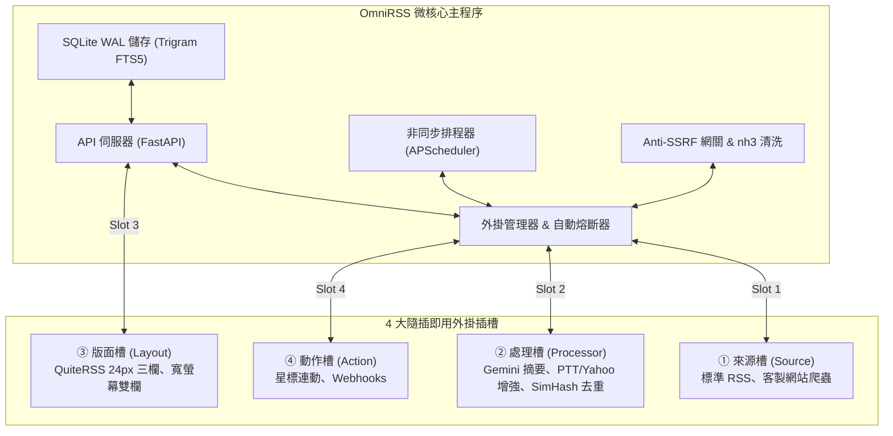

# OmniRSS 🌐

> **微核心 RSS 閱讀器、全文提取與熱插拔外掛平台**  
> *A lightweight, self-hosted RSS reader with a pluggable microkernel architecture.*

[](LICENSE)
[](https://www.python.org/)
[](https://fastapi.tiangolo.com/)
[](https://www.sqlite.org/)
[](tests/)

---

## 為什麼做 OmniRSS？

如果你長年使用桌面端 RSS 閱讀器（如 QuiteRSS），一定會發現多數現代 Web RSS 系統過於臃腫、文章列表行距太寬，或是缺乏對特定論壇與圖文網站的排版還原。

OmniRSS 的核心哲學是 **「主程式做小，擴充性留給外掛」**：
* **極簡核心**：主程式只管定時排程、資料庫讀寫、資安清洗與介面佈局，記憶體佔用小於 150 MB。
* **外掛擴充**：各類網站爬蟲、正文提取、AI 摘要與外部同步，全由隨插即用的 4 大外掛插槽負責。

---

## 🚀 快速開始

### 方式 A：Docker Compose 一鍵啟動（推薦）

這是最簡單快速的運行方式，不需要手動配置 Python 環境：

```bash
# 1. 取得專案原始碼
git clone https://github.com/your-username/OmniRSS.git
cd OmniRSS

# 2. 一鍵後台啟動
docker compose up -d
```

啟動後，使用瀏覽器打開 **`http://localhost:8000`** 即可開始使用！

---

### 方式 B：本機 Python 環境啟動

適用於開發者或希望直接在主機上執行的情境：

```bash
# 1. 建立並啟用虛擬環境
python -m venv .venv
# Windows:
.venv\Scripts\activate
# Linux / macOS:
source .venv/bin/activate

# 2. 安裝必要套件
pip install -r requirements.txt

# 3. 啟動伺服器
uvicorn omnirss.main:app --host 0.0.0.0 --port 8000
```

---

## ✨ 本版功能亮點 (v1.1.0)

### 1. 經典 24px 緊湊桌面流介面
* **高密度清單**：文章列表固定 24px 行高，標題單行不折行、超長自動省略號截斷，一眼瀏覽百篇新訊。
* **純鍵盤極速流**：支援 `J` / `K` 上下巡航、`S` 星標收藏、`M` 標記已讀、`Space` 翻頁滾動。
* **自選欄位 `[ ⊞ ]`**：點擊表頭自選顯示標題、頻道、發布時間、標籤等欄位，並支援即時點選排序。
* **零前端打包**：原生 ES6 模組 + CSS Tokens，不需 Node.js 構建，瀏覽器直讀。

### 2. 實測穩定三大增強外掛
* **PTT Enhancer (`plugins/processors/ptt_enhancer/`)**：
  * 自動修復內文與推文中的 Imgur 純文字圖片直連。
  * 還原作者與看板超連結，長串推文支援一鍵摺疊展開。
* **Yahoo Enhancer (`plugins/processors/yahoo_enhancer/`)**：
  * 自動還原 `data-src` / `data-original` 延遲載入（Lazyload）高解析度原圖。
  * 清除入口網站多餘推薦導流雜訊。
* **Gemini AI Summary (`plugins/processors/gemini_summary/`)**：
  * 動態探測可用模型清單，具備配額自動瀑布流降級機制。
  * 自動提取繁體中文重點條列，生成之摘要快取於本地，重複開啟零 Token 消耗。

### 3. 高韌性 304 條件爬蟲
* **304 Not Modified 快取**：完整支援 HTTP ETag 與 Last-Modified 標頭，未更新的頻道絕不消耗多餘網路流量。
* **三階指紋輪替**：遇到 403 阻擋自動切換 `Chrome 128 標頭 ➔ 自動升級 HTTPS ➔ QuiteRSS Qt 指紋`。
* **Auto-Referer 防盜鏈**：自動補齊來源網站根網域 Referer，實測連通率達 80%。

### 4. SQLite WAL 冷熱儲存底座
* **熱資料表 (`articles_hot`)**：存放近 30~90 天文章中繼資料，搭配 Trigram FTS5 全文索引，支援中英文子字串精準搜尋。
* **冷存庫 (`archives_cold`)**：加星標文章自動以 zstd 高壓縮比保存全文。
* **圖片去重存檔 (`data/images/`)**：圖片自動轉為 WebP 格式並以 SHA-256 雜湊儲存，重複圖片只存一份。

---

## 📖 首次使用三步驟

1. **設定管理員密碼**：第一次開啟網頁時，系統會引導建立第一組管理者帳號。
2. **匯入現有訂閱**：在「設定 ➔ 備份與還原」中，一鍵匯入你從 Feedly、Inoreader 或 QuiteRSS 導出的標準 OPML 檔案。
3. **管理外掛功能**：點擊上方工具列「外掛」，隨時可開關 PTT 還原、Yahoo 圖片修正或填入 Gemini API Key 啟用 AI 摘要。

---

## 🏗️ 系統架構簡覽


```mermaid
graph TD
    subgraph Core["OmniRSS 微核心主程序"]
        Kernel["API 伺服器 (FastAPI)"]
        Scheduler["非同步排程器 (APScheduler)"]
        DBEngine["SQLite WAL 儲存 (Trigram FTS5)"]
        SecurityGate["Anti-SSRF 網關 & nh3 清洗"]
        PluginMgr["外掛管理器 & 自動熔斷器"]
        
        Kernel <--> PluginMgr
        Scheduler <--> PluginMgr
        DBEngine <--> Kernel
        SecurityGate <--> PluginMgr
    end

    subgraph Slots["4 大隨插即用外掛插槽"]
        S1["① 來源槽 (Source)<br>標準 RSS、客製網站爬蟲"]
        S2["② 處理槽 (Processor)<br>Gemini 摘要、PTT/Yahoo 增強、SimHash 去重"]
        S3["③ 版面槽 (Layout)<br>QuiteRSS 24px 三欄、寬螢幕雙欄"]
        S4["④ 動作槽 (Action)<br>星標連動、Webhooks"]
    end

    PluginMgr <-->|Slot 1| S1
    PluginMgr <-->|Slot 2| S2
    Kernel <-->|Slot 3| S3
    PluginMgr <-->|Slot 4| S4
```

---

## 📚 技術與部署文件

* [伺服器與雲端部署手冊 (`docs/DEPLOYMENT.md`)](docs/DEPLOYMENT.md)：Linux VPS / 雲端主機 / 家用 NAS 容器化部署、Nginx 反向代理、SSL 憑證與防限流調優。
* [外掛開發 SDK 指南 (`docs/PLUGIN_SPEC.md`)](docs/PLUGIN_SPEC.md)：如何用 30 行 Python 自行擴充網站爬蟲與處理器。
* [系統架構技術白皮書 (`docs/SPEC.md`)](docs/SPEC.md)：資料庫分層、Anti-SSRF 網路網關與安全性設計。
* [外掛開發貢獻指南 (`CONTRIBUTING.md`)](CONTRIBUTING.md)：參與專案與 Pull Request 規範。

---

## 授權條款

本專案採用 [MIT License](LICENSE) 授權。
