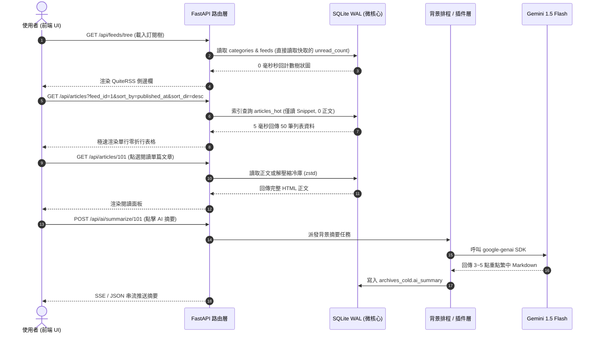

# OmniRSS 前後端 REST API 介面規格書 (API Contract & DTO Specification)

> **專案名稱**：OmniRSS  
> **版本**：v1.0.0 (Context7 & Pydantic v2 Standard)  
> **日期**：2026/09/22  
> **規格書文件路徑**：`docs/API_CONTRACT.md`

---

## 1. 架構概述與設計原則 (Design Philosophy)

OmniRSS 的 API 遵循現代 RESTful 規範與 **Context7 上游工程標準**（FastAPI + Pydantic v2）：
1. **極致輕量與低延遲**：
   - 列表 API (`GET /api/articles`) 僅回傳小於 100 Bytes 的中繼欄位與 200 字 Snippet，絕不傳輸龐大 HTML 正文。
   - 完整正文僅在點擊個別文章時透過 `GET /api/articles/{id}` 按需非同步載入。
2. **全參數開放 (Full Parameter Exposure)**：
   - 所有的修剪天數、快取大小、逾時時間、排程間隔均透過 `/api/config` 開放讀寫。
3. **無鎖並行 (Async Concurrency)**：
   - 所有 I/O 密集型操作（如抓取 RSS、呼叫 Gemini Flash、圖片快取）皆為背景非同步執行，不阻塞前端 UI。
4. **標準統一回應結構 (Envelope & Error Handling)**：
   - 成功回應直接回傳目標資料，錯誤回應統一包裝為 RFC 7807 格式。



---

## 2. API 端點清單總覽 (Endpoints Index)

| 模組 | HTTP 方法 | 路徑 | 說明 |
| :--- | :--- | :--- | :--- |
| **身分認證與用戶** | `POST` | `/api/auth/setup` | 首次啟動引導建立超級管理員帳號 |
| | `POST` | `/api/auth/login` | 使用者帳號密碼登入 (核發 HTTP-Only Session Cookie) |
| | `POST` | `/api/auth/logout` | 登出並清除 Session |
| | `GET` | `/api/auth/me` | 取得當前登入用戶資訊與專屬 API Key |
| | `GET` | `/api/admin/users` | (管理員) 取得全站用戶清單 |
| | `POST` | `/api/admin/users` | (管理員) 建立新用戶帳號 |
| **系統配置** | `GET` | `/api/config` | 讀取所有全域系統設定（保留天數、外觀、排程等） |
| | `PUT` | `/api/config` | 更新系統設定 |
| | `GET` | `/api/health` | 系統健康狀態、資料庫體積、WAL 狀態 |
| **分類與訂閱** | `GET` | `/api/feeds/tree` | 取得階層式訂閱目錄樹（含未讀計數快取） |
| | `POST` | `/api/categories` | 新增分類目錄（如 `10.新聞`） |
| | `PUT` | `/api/categories/{id}` | 修改分類名稱、排序權重 |
| | `DELETE` | `/api/categories/{id}` | 刪除分類 |
| | `POST` | `/api/feeds` | 新增訂閱源（支援 URL 自動偵測 RSS/Atom） |
| | `PUT` | `/api/feeds/{id}` | 修改訂閱源屬性（自訂保留天數、抓取間隔等） |
| | `DELETE` | `/api/feeds/{id}` | 刪除訂閱源 |
| | `POST` | `/api/feeds/{id}/refresh` | 手動強制立即抓取單一頻道 |
| | `POST` | `/api/feeds/refresh-all` | 手動批次觸發所有頻道抓取 |
| **文章串流** | `GET` | `/api/articles` | 查詢文章列表（多欄位排序、正逆序、標籤過濾） |
| | `GET` | `/api/articles/{id}` | 取得單篇文章完整內容與正文 HTML |
| | `PUT` | `/api/articles/{id}/read` | 切換文章已讀／未讀狀態 |
| | `PUT` | `/api/articles/mark-all-read` | 批次標記已讀（支援全站、特定分類或頻道） |
| | `PUT` | `/api/articles/{id}/star` | 切換星號收藏（自動觸發二階段冷存封存） |
| **標籤體系** | `GET` | `/api/tags` | 取得所有自訂彩色標籤 |
| | `POST` | `/api/tags` | 新增標籤（名稱、Hex 顏色碼、排序） |
| | `PUT` | `/api/tags/{id}` | 修改標籤屬性 |
| | `DELETE` | `/api/tags/{id}` | 刪除標籤 |
| | `POST` | `/api/articles/{id}/tags` | 為文章附加標籤 |
| | `DELETE` | `/api/articles/{id}/tags/{tag_id}` | 移除文章標籤 |
| **AI 服務** | `POST` | `/api/ai/summarize/{id}` | 呼叫 Gemini Flash 生成文章繁體中文條列摘要 |
| **插件與遙測** | `GET` | `/api/plugins` | 取得所有插件清單、啟用狀態與健康度指標 |
| | `POST` | `/api/plugins/{id}/toggle` | 啟用或停用指定插件 |
| | `POST` | `/api/plugins/{id}/reset-circuit` | 重置插件熔斷保護狀態 |
| | `GET` | `/api/plugins/{id}/config` | 讀取插件私有設定 |
| | `PUT` | `/api/plugins/{id}/config` | 更新插件私有設定 |
| **邊緣中繼與快剪** | `POST` | `/api/feeds/{id}/ingest` | 接收本機瀏覽器 Edge Relay 中繼回傳之 RSS XML (需 X-API-Key) |
| | `POST` | `/api/articles/push` | 接收 Web Clipper 一鍵網頁剪藏文章 (需 X-API-Key) |
| | `POST` | `/api/config/security/generate-key` | 隨機產生全新 64-bit API 金鑰 (支援 UI 一鍵複製) |
| **圖片金庫** | `GET` | `/api/assets/images/{sha256}` | 讀取快取之去重 WebP 圖片（支援 1 年強快取） |

---

## 3. Pydantic v2 DTO 結構與端點詳細定義

### 3.1 系統配置 (`/api/config`)

#### Pydantic Schema
```python
from pydantic import BaseModel, Field, field_validator
from typing import Optional

class RetentionConfigDTO(BaseModel):
    """資料保留與自動清理參數模型 (QuiteRSS 風格全開放)"""
    global_retention_days: int = Field(
        default=0, 
        ge=0, 
        description="全域保留天數。0 代表永久保留 (Never Delete)，正整數代表保留天數 (例如 60)"
    )
    max_articles_per_feed: int = Field(
        default=0, 
        ge=0, 
        description="每個頻道最大保留篇數。0 代表無上限"
    )
    keep_starred_forever: bool = Field(
        default=True, 
        description="星號收藏文章是否永久保留 (不受過期清理影響)"
    )
    keep_tagged_forever: bool = Field(
        default=True, 
        description="具備標籤的文章是否永久保留"
    )
    auto_vacuum_on_clean: bool = Field(
        default=True, 
        description="修剪文章後是否自動執行 SQLite 增量空間歸還"
    )

class SecurityConfigDTO(BaseModel):
    """資安鑑權與中繼注入設定 (支援金鑰自動隨機產生)"""
    allow_external_ingest: bool = Field(
        default=False, 
        description="是否開啟外部中繼/快剪推播 API 總開關 (預設關閉確保 100% 安全)"
    )
    api_key: str = Field(
        default_factory=lambda: secrets.token_urlsafe(32),
        description="64-bit 安全鑑權金鑰。若為空或未設定，系統自動使用 secrets.token_urlsafe(32) 隨機生成，使用者亦可隨時自訂或一鍵重新產生"
    )

class SystemConfigDTO(BaseModel):
    """OmniRSS 系統全域設定 DTO"""
    app_title: str = Field(default="OmniRSS", max_length=50)
    language: str = Field(default="zh-TW", description="預設語系 (zh-TW, en-US 等)")
    active_layout: str = Field(default="quiterss_compact", description="當前使用的 UI 版型插件/範本")
    polling_interval_minutes: int = Field(default=30, ge=5, le=1440, description="全域預設抓取間隔 (分鐘)")
    retention: RetentionConfigDTO = Field(default_factory=RetentionConfigDTO)
    security: SecurityConfigDTO = Field(default_factory=SecurityConfigDTO)
```

---

### 3.2 訂閱樹狀圖 (`GET /api/feeds/tree`)

#### Response Schema
```python
class FeedTreeItemDTO(BaseModel):
    """訂閱源節點模型"""
    id: int
    title: str
    feed_url: str
    site_url: Optional[str] = None
    icon_url: Optional[str] = None
    unread_count: int = Field(ge=0, description="由資料庫觸發器維護的即時未讀數")
    custom_retention_days: Optional[int] = Field(
        default=None, 
        description="個別頻道保留政策 (NULL: 繼承全域, -1: 永久保留, >0: 自訂天數)"
    )
    is_paused: bool = False
    error_count: int = 0
    last_error_message: Optional[str] = None
    last_checked_at: Optional[str] = None

class CategoryTreeItemDTO(BaseModel):
    """分類目錄節點模型 (支援編號排序)"""
    id: int
    name: str = Field(description="例如: '10.新聞', '70.部落格'")
    sort_order: int = Field(default=0, description="權重排序 (自動由編號解析)")
    unread_count: int = Field(ge=0, description="該分類下所有頻道未讀總數快取")
    feeds: list[FeedTreeItemDTO] = Field(default_factory=list)

class FeedTreeResponseDTO(BaseModel):
    """全站訂閱樹完整回應"""
    categories: list[CategoryTreeItemDTO]
    uncategorized_feeds: list[FeedTreeItemDTO] = Field(default_factory=list)
    total_unread_count: int = Field(ge=0, description="全站總未讀數")
```

---

### 3.3 文章清單查詢 (`GET /api/articles`)

#### Query Parameters
- `feed_id`: `Optional[int]` —— 依指定頻道篩選。
- `category_id`: `Optional[int]` —— 依指定分類篩選。
- `is_read`: `Optional[bool]` —— 篩選已讀 (`true`) 或未讀 (`false`)。
- `is_starred`: `Optional[bool]` —— 篩選收藏文章 (`true`)。
- `tag_id`: `Optional[int]` —— 依特定標籤篩選。
- `search`: `Optional[str]` —— 關鍵字（自動路由至 SQLite FTS5 全文索引）。
- `sort_by`: `str = "published_at"` —— 排序欄位，支援：
  - `published_at`（發布時間）
  - `title`（標題）
  - `author`（作者）
  - `feed_title`（來源名稱）
  - `is_starred`（收藏優先）
  - `is_read`（未讀優先）
- `sort_dir`: `str = "desc"` —— 排序方向：`asc`（正序）或 `desc`（逆序）。
- `limit`: `int = 100` —— 每頁筆數（預設 100，支援百萬量級虛擬滾動）。
- `offset`: `int = 0` —— 偏移分頁。

#### Article ListItem Schema (極致輕量化，單筆 < 100B)
```python
class ArticleTagBadgeDTO(BaseModel):
    id: int
    name: str
    color_hex: str

class ArticleListItemDTO(BaseModel):
    """列表單行輕量中繼資料 (供 QuiteRSS 單行表格極速渲染)"""
    id: int
    feed_id: int
    feed_title: str
    entry_hash: str
    title: str
    url: str
    author: Optional[str] = None
    snippet: str = Field(description="前 200 字純文字預覽，無任何 HTML 標籤")
    published_at: str
    is_read: bool
    is_starred: bool
    tags: list[ArticleTagBadgeDTO] = Field(default_factory=list)
    has_image: bool = Field(default=False, description="是否包含內嵌圖片")

class ArticleListResponseDTO(BaseModel):
    total: int
    limit: int
    offset: int
    articles: list[ArticleListItemDTO]
```

---

### 3.4 單篇文章完整內容 (`GET /api/articles/{id}`)

#### Response Schema
```python
class ArticleDetailDTO(BaseModel):
    """單篇文章詳細內容 (點擊閱讀時按需載入)"""
    id: int
    feed_id: int
    feed_title: str
    title: str
    url: str
    author: Optional[str] = None
    published_at: str
    is_read: bool
    is_starred: bool
    tags: list[ArticleTagBadgeDTO] = Field(default_factory=list)
    
    content_html: str = Field(description="乾淨正文 HTML (已替換為本地去重圖片 URL)")
    ai_summary: Optional[str] = Field(default=None, description="Gemini Flash 重點條列摘要")
    is_archived: bool = Field(default=False, description="是否已在冷庫永久存檔")
```

---

### 3.5 標記操作 API (`PUT /api/articles/{id}/read` & `PUT /api/articles/{id}/star`)

#### Request / Response
- **Toggle Read**:
  - `PUT /api/articles/{id}/read`
  - Body: `{"is_read": true}`
  - Response: `{"success": true, "id": 101, "is_read": true, "feed_unread_count": 12}`
- **Toggle Star**:
  - `PUT /api/articles/{id}/star`
  - Body: `{"is_starred": true}`
  - Response: `{"success": true, "id": 101, "is_starred": true, "archived_cold": true}`
  - *Tech Note*: 當 `is_starred` 設為 `true` 時，微核心後台自動將該文章的全文進行 `zstd` 壓縮寫入 `archives_cold`，並將內嵌圖片下載至 `data/images/` 達成永久保存。

---

### 3.6 AI 智慧摘要 API (`POST /api/ai/summarize/{id}`)

- **路徑**：`POST /api/ai/summarize/{article_id}`
- **說明**：以 `google-genai` 官方 SDK 動態探索當前可用之 Gemini Flash 模型（支援動態額度瀑布降級），根據文章全文生成 3~5 點繁體中文精華摘要。
- **Response**:
```json
{
  "article_id": 101,
  "ai_summary": "- 本次更新聚焦於輕量微核心與插件槽架構設計。\n- 透過 SQLite WAL 與雙層去重徹底解決資料庫膨脹與洗版問題。\n- 前端維持 QuiteRSS 經典單行零折行緊湊佈局。",
  "generated_at": "2026-09-22T10:35:00Z",
  "cached": false
}
```

---

### 3.7 插件遙測與治理 API (`/api/plugins`)

#### Response Schema
```python
class PluginTelemetryDTO(BaseModel):
    plugin_id: str
    name: str
    version: str
    author: str
    slot_type: str = Field(description="Source, Processor, Layout, Action")
    is_enabled: bool
    is_tripped: bool = Field(description="是否觸發連續 5 次失敗自動熔斷")
    
    total_runs: int
    success_runs: int
    error_runs: int
    consecutive_errors: int
    avg_duration_ms: int
    last_error_message: Optional[str] = None
    last_run_at: Optional[str] = None

class PluginListResponseDTO(BaseModel):
    plugins: list[PluginTelemetryDTO]
```

---

### 3.8 邊緣中繼與網頁剪藏注入 API (`/api/feeds/{id}/ingest` & `/api/articles/push`)

> 🛡️ **資安防護規範**：本組端點強制要求 `X-API-Key` 鑑權標頭，且傳入之 HTML 強制通過 `nh3` Rust 級脫毒過濾器，徹底消滅 Stored XSS 與惡意腳本。

#### 3.8.1 查詢當前用戶個人待中繼頻道任務 (`GET /api/feeds/edge-tasks`)
* **標頭**：`X-API-Key: omni_sec_xxxx...`
* **說明**：依 `X-API-Key` 鑑權並**僅撈取該特定使用者自己訂閱 (`user_feeds`)** 且在伺服器端遭遇 403 阻擋之頻道清單，絕不外流全域或其他用戶之訂閱。
* **Response Schema**:
```python
class EdgeTaskItemDTO(BaseModel):
    feed_id: int
    url: str
    custom_headers: dict[str, str] = Field(default_factory=dict)

class EdgeTaskListResponseDTO(BaseModel):
    tasks: list[EdgeTaskItemDTO]
```

#### 3.8.2 接收本機瀏覽器中繼回傳之 RSS XML (`POST /api/feeds/{id}/ingest`)
* **標頭**：`X-API-Key: omni_sec_xxxx...`
* **Request Body**:
```python
class FeedIngestRequestDTO(BaseModel):
    raw_xml: str = Field(max_length=5_000_000, description="本機瀏覽器使用家用寬頻抓取到的原始 RSS/Atom XML 字串")
```
* **Response**: `{"success": true, "feed_id": 12, "new_articles_count": 4}`

#### 3.8.3 接收 Web Clipper 一鍵網頁剪藏文章 (`POST /api/articles/push`)
* **標頭**：`X-API-Key: omni_sec_xxxx...`
* **Request Body**:
```python
class MediaManifestItemDTO(BaseModel):
    type: str = Field(description="'image' | 'video_embed' | 'video_direct' | 'audio'")
    src: str = Field(description="原始或嵌入來源 URL")
    poster: Optional[str] = Field(default=None, description="影片/音訊封面圖 URL")
    caption: Optional[str] = None
    file_size_bytes: Optional[int] = None

class ArticlePushRequestDTO(BaseModel):
    url: str = Field(description="剪藏原始來源網址")
    canonical_url: Optional[str] = None
    title: str = Field(max_length=500, description="文章標題")
    site_name: Optional[str] = Field(default=None, description="來源站台名稱 (如 Medium, TechNews)")
    favicon_url: Optional[str] = None
    author: Optional[str] = None
    published_at: Optional[str] = Field(default=None, description="文章原始發布時間 (ISO-8601)")
    excerpt: Optional[str] = Field(default=None, max_length=1000, description="前 200 字摘要")
    reading_time_min: Optional[int] = Field(default=None, ge=1)
    og_image: Optional[str] = Field(default=None, description="文章主圖/封面 URL")
    content_html: str = Field(max_length=10_000_000, description="清洗後之語意化 HTML 正文")
    content_text: Optional[str] = Field(default=None, description="純文字內容 (供 FTS5 全文索引)")
    media_manifest: list[MediaManifestItemDTO] = Field(default_factory=list, description="多媒體資源清冊")
    target_category_id: Optional[int] = Field(default=None, description="指定歸屬目錄 ID")
    target_tag: Optional[str] = Field(default="隨手存", description="自動附加之標籤名稱")
    auto_summarize: bool = Field(default=True, description="是否立即觸發 Gemini Flash 繁中重點摘要")
```
* **Response**: `{"success": true, "article_id": 205, "archived_cold": true, "quota_used_bytes": 1048576}`

#### 3.8.4 隨機產生並重置安全金鑰 (`POST /api/config/security/generate-key`)
* **說明**：隨機產出 64-bit URL-Safe 安全 Token，並同步更新至 `config.json`，前端 UI 提供「一鍵複製」按鈕以供瀏覽器插件配對。
* **Response**:
```json
{
  "api_key": "omni_sec_8Fj2k9LmN7PqR4TsV1WxY3ZbCdEfGhJk",
  "generated_at": "2026-09-22T11:15:00Z"
}
```

---

### 3.9 資料便攜、備份與還原 API (`/api/opml` & `/api/user/backup`)

#### 3.9.1 匯出全量 OPML 2.0 訂閱檔 (`GET /api/opml/export`)
* **說明**：產生標準 OPML 2.0 XML 檔案（附帶 `Content-Disposition: attachment; filename="omnirss_subscriptions.opml"`），完整保留分類目錄階層與自訂頻道別名。
* **Response**: `application/xml` (標準 OPML 字串)

#### 3.9.2 匯入 OPML 訂閱檔 (`POST /api/opml/import`)
* **說明**：接收使用者上傳之 `.opml` 檔案，自動解析並批次還原分類目錄與頻道，自動去重並建立關聯。
* **Request**: Multipart Form Data (`file: UploadFile`)
* **Response**: `{"success": true, "categories_created": 8, "feeds_imported": 475}`

#### 3.9.3 匯出個人自訂規則與配置備份 (`GET /api/user/backup`)
* **Query Parameters**:
  - `include_secrets: bool = false` —— 是否包含敏感金鑰（**預設強制為 `false` 進行脫敏遮蔽**）。
* **資安防護機制 (Secret Redaction Policy)**：
  - **預設安全脫敏 (`include_secrets=false`)**：所有外掛配置中標註為 `"sensitive": true` 或名稱包含 `*_key`, `*_token`, `*_secret`, `password` 之欄位，自動替換為 `"[REDACTED]"` 脫敏遮蔽，**徹底防止備份檔外洩導致 AI 額度或私鑰被盜用**。
  - **完整備份模式 (`include_secrets=true`)**：需在 Web UI 勾選高風險二次確認彈窗，或可選提供密碼進行 AES-256 加密封裝。
* **Response Schema**:
```json
{
  "version": "1.0.0",
  "exported_at": "2026-09-22T14:30:00Z",
  "includes_secrets": false,
  "rules": [...],
  "tags": [...],
  "plugin_configs": {
    "omnirss/gemini-summary": {
      "gemini_api_key": "[REDACTED]",
      "model_name": "gemini-2.5-flash",
      "auto_summary_starred": true
    }
  }
}
```

#### 3.9.4 還原個人自訂規則與配置 (`POST /api/user/restore`)
* **說明**：接收 JSON 備份檔並一鍵還原過濾規則與偏好。若設定檔中敏感金鑰為 `[REDACTED]`，系統將保留當前伺服器中既有的私鑰不予覆蓋，安全無痛合併。
* **Request Body**: `UserBackupRestoreDTO`
* **Response**: `{"success": true, "rules_restored": 12, "tags_restored": 5, "secrets_preserved": true}`

---

## 4. 錯誤處理規範 (RFC 7807 Standard)

當 API 發生錯誤時，HTTP 狀態碼與回應格式嚴格遵循以下結構：

```json
{
  "type": "https://omnirss.local/errors/not-found",
  "title": "Article Not Found",
  "status": 404,
  "detail": "Article with ID 99999 does not exist.",
  "instance": "/api/articles/99999",
  "timestamp": "2026-09-22T10:35:00Z"
}
```

- `400 Bad Request`：參數不合法（例如 `sort_by` 填寫不存在的欄位）。
- `404 Not Found`：指定資源（Feed, Category, Article, Tag）不存在。
- `409 Conflict`：新增重複的 Feed URL 或已存在的 Category 名稱。
- `503 Service Unavailable`：下游插件崩潰或連線逾時（附帶熔斷狀態）。

---

## 5. 後續實作對齊檢查點 (Implementation Alignment)

在 Phase 2（API 與微核心施工）時，後端將使用 FastAPI 完整註冊本規格書定義之路由器：
1. `routers/config_router.py` ➔ `/api/config`
2. `routers/feeds_router.py` ➔ `/api/feeds`, `/api/categories`
3. `routers/articles_router.py` ➔ `/api/articles`
4. `routers/tags_router.py` ➔ `/api/tags`
5. `routers/ai_router.py` ➔ `/api/ai`
6. `routers/plugins_router.py` ➔ `/api/plugins`
