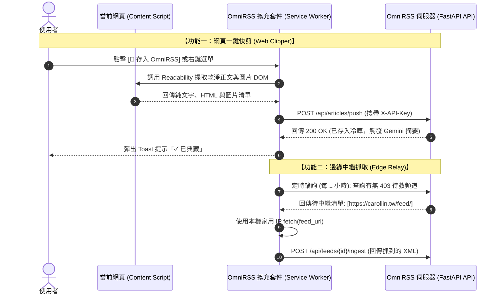
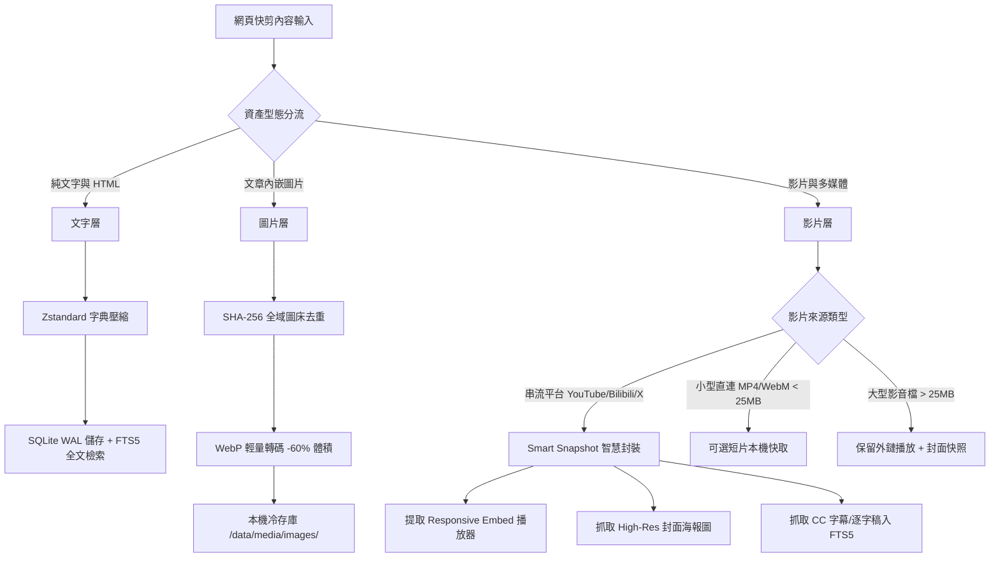

# OmniRSS Companion 瀏覽器擴充套件規格書 (Chrome Extension & Web Clipper Specification)

> **專案名稱**：OmniRSS Companion  
> **版本**：v1.0.0 (Manifest V3 Standard)  
> **日期**：2026/09/22  
> **規格書文件路徑**：`docs/CHROME_EXTENSION_SPEC.md`

---

## 1. 擴充套件定位與核心使命 (Mission & Architecture)

**OmniRSS Companion** 是一款基於 **Google Chrome Manifest V3** 規範打造的輕量化瀏覽器擴充套件，具備兩大核心使命：
1. **Web Clipper（全能網頁一鍵快剪）**：將使用者在瀏覽器中看到的任何優質文章（即便是無 RSS 輸出或付費會員文章），一鍵去廣告並打包存入 OmniRSS 雲端冷存庫。
2. **Edge Relay Worker（分散式邊緣中繼抓取器）**：利用使用者本機純淨的家用寬頻 IP，在背景協助伺服器中繼抓取被 Cloudflare 阻擋的特定 RSS 來源。



---

## 2. Manifest V3 規格定義 (`manifest.json`)

遵循最小權限原則（Least Privilege），絕不申請多餘權限：

```json
{
  "manifest_version": 3,
  "name": "OmniRSS Companion",
  "version": "1.0.0",
  "description": "OmniRSS 官方瀏覽器助手：支援全能網頁一鍵剪藏與分散式邊緣中繼抓取。",
  "icons": {
    "16": "icons/icon16.png",
    "48": "icons/icon48.png",
    "128": "icons/icon128.png"
  },
  "action": {
    "default_popup": "popup/popup.html",
    "default_title": "OmniRSS Companion"
  },
  "background": {
    "service_worker": "background.js",
    "type": "module"
  },
  "permissions": [
    "activeTab",
    "storage",
    "contextMenus",
    "alarms"
  ],
  "host_permissions": [
    "<all_urls>"
  ]
}
```

---

## 3. 模組架構與職責分配 (Modules Specification)

### 3.1 彈窗與設定介面 (`popup/` & `options/`)
* **配對設定視圖 (Pairing View)**：
  - 輸入伺服器網址（例如 `https://rss.yourdomain.com`）。
  - 輸入或貼上個人專屬 `X-API-Key`。
  - 點擊「連線測試」驗證金鑰合法性，成功後儲存至 `chrome.storage.sync`。
* **使用者偏好設定 (Preferences)**：
  - 🔘 **右鍵選單開關 (`enable_context_menu`, 預設: `false`)**：
    - 依使用者喜好決定是否在瀏覽器右鍵選單注入捷徑，**杜絕右鍵選單雜亂**。
    - 開關關閉時立即執行 `chrome.contextMenus.removeAll()`，保持右鍵極致乾淨。
  - 🔘 **邊緣中繼輔助開關 (`enable_edge_relay`, 預設: `true`)**：
    - 由使用者自由決定是否在背景利用家用 IP 協助中繼**「自己所訂閱」**受阻的 RSS。
    - 關閉時立即清除排程 (`chrome.alarms.clear()`)，背景零常駐、零流量消耗。
  - ⏱️ **邊緣中繼排程間隔 (`edge_relay_interval_min`, 預設: `30` 分鐘)**：
    - 使用者可自由設定背景檢查頻率（可選 `15` / `30` / `60` / `120` 分鐘）。
  - 🔘 **快剪預設自動摘要 (`auto_summarize`, 預設: `true`)**：存入時是否同步調用 Gemini Flash 生成重點摘要。
  - 🔘 **多媒體快取模式 (`media_cache_mode`, 預設: `smart_snapshot`)**：
    - `text_only`：僅存文字與外鏈圖片。
    - `smart_snapshot`（推薦）：文字 + WebP 去重圖片 + 智慧影片嵌入/封面/逐字稿。
    - `full_archive`：包含 25MB 以內之直接短影片快取。
* **快速剪藏預覽視圖 (Clip Preview View)**：
  - 自動抓取當前分頁標題、網站名稱、封面縮圖與網址。
  - 快速勾選或輸入標籤（預設 `隨手存`，可自訂如 `技術筆記`、`美食清單`）。
  - 選擇目標分類資料夾。
  - 點擊 `[ 🚀 立即存入 OmniRSS ]`。

### 3.2 網頁深度解析器 (`content_scripts/extractor.js`)
* 基於 Mozilla 輕量化 `Readability.js` + JSON-LD / Meta 深度解析器。
* **完整中繼資料提取清冊 (Rich Metadata Schema)**：
  1. `url` & `canonical_url`：原始與標準網址。
  2. `title`：文章主標題。
  3. `site_name`：來源網站名稱（如 *Medium, 科技新報, GitHub*）。
  4. `favicon_url`：網站 High-Res 圖示。
  5. `author` / `byline`：作者或發表組織。
  6. `published_at`：原始發表時間（自動解析 `<meta property="article:published_time">` 或 Schema.org JSON-LD）。
  7. `clipped_at`：快剪時間戳記（ISO-8601）。
  8. `excerpt`：前 200 字乾淨導讀摘要。
  9. `reading_time_min`：預估閱讀時間（以中文 400 字/分、英文 200 字/分計算）。
  10. `og_image`：文章封面主圖 URL。
  11. `content_html`：去廣告、去側邊欄、去追蹤代碼後的語意化 HTML。
  12. `content_text`：純文字正文（供 SQLite FTS5 全文索引與 SimHash 語意去重）。
  13. `media_manifest`：多媒體資產清單（圖片 URL 清冊、影片嵌入 iframe 與直連清冊）。

### 3.3 背景常駐守護行程 (`background.js`)

#### A. 右鍵選單動態註冊 (Configurable Context Menus)
* **防衛性選單治理**：僅在使用者於設定中開啟 `enable_context_menu === true` 時動態註冊，絕不強制常駐污染右鍵：
  1. **空白處右鍵** ➔ `📌 將當前網頁存入 OmniRSS`
  2. **選取文字時右鍵** ➔ `📌 將選取文字與網頁存入 OmniRSS`
  3. **連結上右鍵** ➔ `📌 將此連結目標存入 OmniRSS`
* 若使用者關閉開關，背景行程立即調用 `chrome.contextMenus.removeAll()` 徹底清除。

#### B. 個人專屬邊緣中繼排程 (User-Isolated Edge Relay Cron)
* **權責分明與隱私隔離原則 (Strict Privacy & Scope Boundary)**：
  - 中繼任務**嚴格限定於「當前使用者自己有訂閱」且伺服器端發生 403 阻擋的頻道**。
  - 伺服器端依傳入的 `X-API-Key` 鎖定 `user_feeds` 範圍，**絕不派發全域或其他用戶的訂閱任務**，杜絕隱私洩漏與資安牽連。
* **排程運作機制**：
  - 依使用者自訂頻率（預設 30 或 60 分鐘），透過 `chrome.alarms` 於背景喚醒。
  - 發送鑑權請求詢問伺服器：`GET /api/feeds/edge-tasks`。
  - 若個人訂閱中有頻道受阻，利用本機純淨家用 IP 發出 `fetch()` 取得最新 XML。
  - 將 XML 推回伺服器：`POST /api/feeds/{id}/ingest`，無縫完成該用戶專屬訂閱更新！
* **即時停用保證**：
  - 若使用者將 `enable_edge_relay` 設為關閉，背景立即執行 `chrome.alarms.clear("omni_edge_relay")`，完全不耗費任何本機網路與運算資源。

---

## 4. 全文、圖片與影片保存策略 (Media Preservation Architecture)

> 💡 **Tech Lead 房屋翻修哲學**：  
> 伺服器硬碟就像自家的實體收納空間，不能把鄰居的大卡車（4K 影片原檔）整台搬進客廳塞爆空間；而是要將貴重相簿（圖片）輕量化壓縮去重，並將大型家具（影片）保存專屬鑰匙與高清全貌。



### 4.1 文字與文章本體 (Text Layer)
* **極致壓縮**：HTML 與純文字存入 SQLite，啟用 Zstandard (zstd) 字典壓縮。
* **空間佔用**：10,000 篇長文僅佔約 20~30 MB，成本近乎為零。

### 4.2 圖片去重與轉碼 (Image Layer)
* **SHA-256 全域去重複 (Content-Addressed Storage)**：
  - 下載圖片時計算雜湊值，若不同文章或 RSS 引用相同圖檔（如網站 Logo、作者頭貼），伺服器僅存一份實體檔案。
* **WebP 自動最佳化**：
  - 下載後由背景工作轉為 WebP 格式，節省 50%~70% 磁碟空間。

### 4.3 影片智慧封裝策略 (Video Smart Snapshot)
* **串流平台影片 (YouTube, Bilibili, Vimeo, X, TikTok)**：
  - **不下載原始巨型影音檔**（避免 3 支影片耗盡 OCI 免費 50GB 磁碟）。
  - **完整封裝四要素**：
    1. **Responsive Embed Player**：保留官方標準響應式嵌入程式碼，在 OmniRSS 內可直接原地播放。
    2. **High-Res Poster 封面海報**：下載最高解析度縮圖快取至本機。
    3. **Metadata**：保存時長、頻道名稱、影片簡介。
    4. **CC 逐字稿 / 字幕 (Transcript)**：若該影片具備字幕，一併抓取存入 FTS5 全文索引，實現「影片講過的話也能被搜尋到」！
* **小型直連短片 (Direct MP4 / WebM)**：
  - 若檔案大小 $\le 25\text{ MB}$ 且使用者於設定開啟短片快取，則下載至 `/data/media/videos/`；超過上限則自動降級為外鏈播放 + 縮圖快照。

---

## 5. 儲存配額與生命週期治理 (Storage Quotas & Governance)

為了確保在 OCI Always Free（總容量 50GB）環境下數百位用戶能穩定並存，系統建立三級防禦限額：

| 治理維度 | 預設限制 | 說明與防禦目的 |
| :--- | :--- | :--- |
| **單篇快剪上限** | `15 MB` | `max_single_clip_size_mb`，防止惡意巨型網頁或無限滾動頁面炸庫 |
| **單一短影片快取上限** | `25 MB` | `max_single_video_size_mb`，僅允許短動圖/小教學短片本機冷存 |
| **每位用戶總冷存配額** | `1,024 MB (1GB)` | `user_storage_quota_mb`，自架管理員可於後台針對特定用戶調整 |
| **容量預警門檻** | `90%` | 當用戶冷存庫達 900MB 時，前端與插件顯示黃色容量告警 |
| **生命週期自動修剪 (Pruning)** | 可選啟用 | 可設定「超過 180 天且未加星標/無標籤」的文章圖片自動轉為外鏈，釋放本機空間 |

---

## 6. 安全通訊與離線容錯機制 (Security & Resilience)

1. **零密碼傳輸**：擴充套件中**絕不儲存使用者之帳號密碼**，僅存放 256-bit 的 `X-API-Key`。
2. **離線暫存隊列 (Offline Queue)**：若遇到斷網或伺服器維護中，剪藏的文章自動暫存於本地 `chrome.storage.local`，待連線恢復後自動補發。
3. **XSS 雙向防護**：擴充套件傳出前進行初步 DOM 轉義，伺服器接收端強制通過 `nh3` Rust 脫毒器，杜絕任何跨站腳本漏洞。
4. **配額超額防護 (413 Payload Too Large)**：若傳入資料或累積容量超出配額，伺服器優雅拒絕並回傳清晰之配額錯誤代碼，不影響其他用戶。
