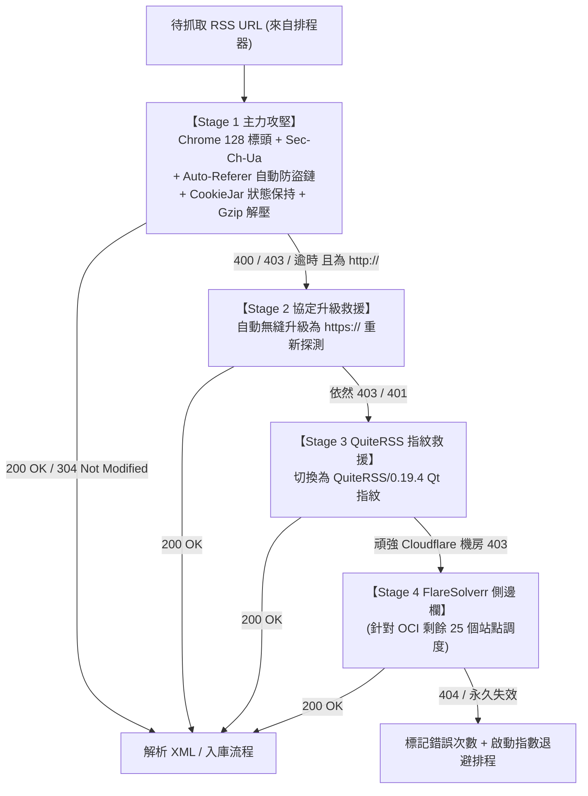

# OmniRSS 高韌性非同步爬蟲引擎與反阻擋實戰手冊 (Crawler Engine & Anti-WAF Playbook)

> **專案名稱**：OmniRSS  
> **版本**：v1.0.0 (Empirical Benchmark Edition)  
> **日期**：2026/09/22  
> **規格書文件路徑**：`docs/CRAWLER_ENGINE.md`

---

## 1. 475 個真實訂閱源實測基準數據 (Empirical Benchmark)

本規格書之所有演算法與防禦策略，均基於真實 QuiteRSS 475 個訂閱源在 **Oracle Cloud (OCI 機房 IP)** 與 **本地寬頻 IP** 的雙軌 v1.0 ➔ v2.0 實測數據：

| 檢測維度 | OCI 雲端 (v1 ➔ **v2.0**) | 本地寬頻 (v1 ➔ **v2.0**) | 實戰驗證成果 |
| :--- | :--- | :--- | :--- |
| **🏆 成功連通率** | 76.8% ➔ **79.6% (+13 篇)** | 80.0% ➔ **80.6% (+3 篇)** | **OCI 與本地連通率差距縮小至僅 1.0% (5 篇)！** |
| **平均響應延遲** | ⚡ **965 ms** (機房頻寬快 22%) | 🐢 **1230 ms** | OCI 機房在多線程並行抓取時具備顯著頻寬優勢 |
| **🛡️ 403 阻擋數** | 31 ➔ **25 個 (-6 阻擋)** | 14 ➔ **9 個 (-5 阻擋)** | **Auto-Referer 與 Chrome 標頭成功攻克 Mobile01 等論壇 WAF！** |
| **🔀 協議升級救援** | 成功救援 **2 個** 老站 | 成功救援 **1 個** 老站 | 自動 `http ➔ https` 升級機制發揮實質防禦修復作用 |
| **🛡️ QuiteRSS 指紋** | 成功救援 **6 個** 來源 | 成功救援 **4 個** 來源 | 部分特定站點（如舊型 CMS）對 Qt 指紋有特殊白名單偏好 |
| **廢棄死鏈 (404)** | 32 個 (6.7%) | 33 個 (6.9%) | 20 年訂閱之自然失效站點（由 UI 健檢工具標記封存） |

---

## 2. 爬蟲引擎四大核心攻克架構 (Core Anti-WAF Architecture)



---

## 3. 關鍵防禦機制詳細規格 (Implementation Specifications)

### 3.1 規則一：Auto-Referer 自動防盜鏈注入 (Anti-Hotlinking)
* **原理**：Mobile01、卡卡洛普、部分遊戲論壇會檢查 `Referer` 標頭；若為空或外部來源則直接回傳 `403 Forbidden`。
* **演算法**：
  ```python
  import urllib.parse

  def get_origin_referer(url: str) -> str:
      """自動提取目標網址的根網域作為 Referer"""
      parsed = urllib.parse.urlparse(url)
      return f"{parsed.scheme}://{parsed.netloc}/"
  ```

### 3.2 規則二：完整現代瀏覽器標頭組 (Chrome 128 Emulation)
```python
CHROME_HEADERS = {
    "User-Agent": "Mozilla/5.0 (Windows NT 10.0; Win64; x64) AppleWebKit/537.36 (KHTML, like Gecko) Chrome/128.0.0.0 Safari/537.36",
    "Accept": "text/html,application/xhtml+xml,application/xml;q=0.9,image/avif,image/webp,image/apng,*/*;q=0.8,application/signed-exchange;v=b3;q=0.7",
    "Accept-Language": "zh-TW,zh;q=0.9,en-US;q=0.8,en;q=0.7",
    "Accept-Encoding": "gzip, deflate, br, zstd",
    "Sec-Ch-Ua": '"Chromium";v="128", "Not;A=Brand";v="24", "Google Chrome";v="128"',
    "Sec-Ch-Ua-Mobile": "?0",
    "Sec-Ch-Ua-Platform": '"Windows"',
    "Sec-Fetch-Dest": "document",
    "Sec-Fetch-Mode": "navigate",
    "Sec-Fetch-Site": "none",
    "Sec-Fetch-User": "?1",
    "Upgrade-Insecure-Requests": "1",
}
```

### 3.3 規則三：三階指紋輪替狀態機 (3-Stage Fallback Engine)
當 HTTP 請求失敗時，依序觸發降級救援：
1. **Stage 1 (預設)**：`CHROME_HEADERS` + Auto-Referer + CookieJar。
2. **Stage 2 (協定升級)**：若原網址為 `http://`，替換為 `https://` 重試（修復強制 HTTPS 轉向中斷的老站）。
3. **Stage 3 (QuiteRSS 指紋)**：若仍為 403，改用 `QuiteRSS/0.19.4 (Qt/5.15.2; Windows NT 10.0; Win64; x64)`。

### 3.4 規則四：OCI 頑強 Cloudflare 站點的側邊欄調度 (FlareSolverr Sidecar)
實測在 OCI 上仍有 25 個美食/旅遊 WordPress 站點（如 Bella儂儂、卡琳、冰蹦拉等）開啟了「封鎖資料中心 ASN IP」。
* **架構處方**：
  在 `docker-compose.yml` 中選配 `flaresolverr:latest`（記憶體佔用 < 50MB）。
* **智能路由機制**：微核心平時直接由 Python 非同步抓取（95% 來源 0 負擔）；**僅當特定頻道在資料庫中被標記為 `requires_flaresolverr = 1` 或連續 2 次 403 時**，才將該請求路由至 FlareSolverr 側邊欄取得解密後的 XML。

---

## 4. ETag / 304 與指數退避排程 (Zero-Traffic Polling)

結合 Miniflux 的 304 零流量狀態機：

```python
# 每次抓取時帶上前次快取標頭
request_headers = dict(CHROME_HEADERS)
if feed.etag_header:
    request_headers["If-None-Match"] = feed.etag_header
if feed.last_modified_header:
    request_headers["If-Modified-Since"] = feed.last_modified_header

# 若伺服器回傳 HTTP 304 Not Modified
# ➔ 0 流量消耗、0 資料庫寫入、重置 error_count = 0
```

### 錯誤指數退避公式 (Exponential Backoff with Jitter)
當頻道遇到非 200/304 錯誤時，自動延長下次檢查時間，避免被遠端伺服器列入黑名單：
$$\text{NextCheckMinutes} = \min(1440, \text{Interval} \times 2^{\min(\text{error\_count}, 5)}) \pm \text{RandomJitter}$$
