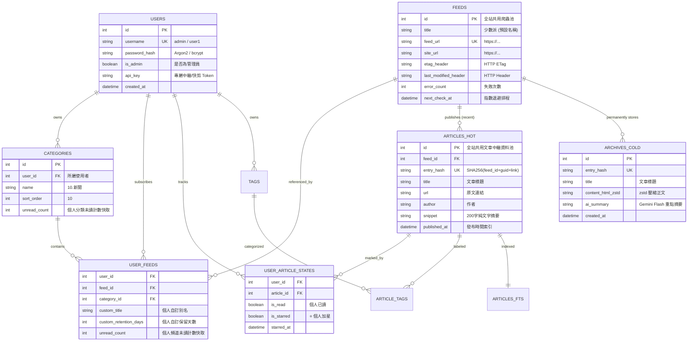
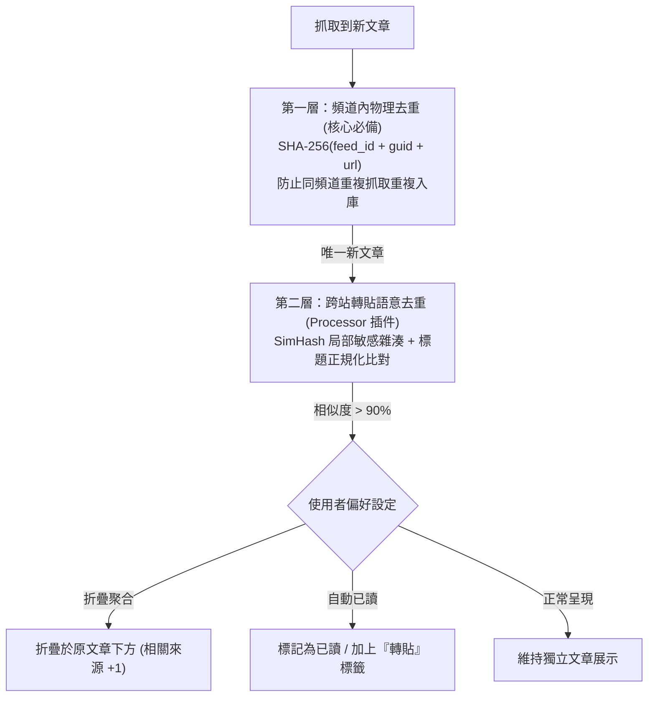

# OmniRSS 資料庫架構與各大開源閱讀器優化設計書 (Database Schema & Storage Architecture)

> **專案名稱**：OmniRSS  
> **版本**：v1.0.0 (Expert Optimized Edition)  
> **日期**：2026/09/22  
> **規格書文件路徑**：`docs/DATABASE_SCHEMA.md`

---

## 1. 各大開源 RSS 閱讀器資料庫設計會診與借鑑 (Open-Source Survey)

為了打造出極致抗肥大、零鎖定且支援百萬文章的架構，我們深度調研了開源界最頂級的 4 大閱讀器架構：

| 閱讀器 | 底層資料庫 | 核心設計亮點 | 致命痛點 / 缺點 | OmniRSS 借鑑與超越對策 |
| :--- | :--- | :--- | :--- | :--- |
| **Miniflux**<br>*(Go)* | PostgreSQL | • **SHA-256 Entry Hash 去重**<br>• ETag/304 與指數退避排程 | 依賴 Postgres Trigger，單機部署較重 | **完全吸收其 SHA-256 去重演算法與 304 智能退避狀態機** |
| **NetNewsWire**<br>*(Swift / Mac)* | SQLite 3 | • **輕重資料解耦 (Content Decoupling)**<br>• **未讀計數反正規化快取 (Denormalized Cache)** | 純桌面本地庫，無多用戶與外掛 API | **吸收其「列表僅讀 50B 中繼資料、正文獨立存放」原則，滑動 0 延遲** |
| **FreshRSS**<br>*(PHP)* | MySQL / SQLite | • 豐富的許多對多標籤 (Tagging)<br>• 使用者自訂過期封存原則 | 為了相容多種 DB，無法使用 SQLite 專屬黑科技 | **保留其多標籤架構，並以 SQLite FTS5 取代其笨重的 LIKE 模糊查詢** |
| **QuiteRSS**<br>*(C++ / Qt)* | SQLite 3 | • 完整的 10+ 種中繼資料欄位<br>• 標籤顏色與自訂樹狀階層 | ❌ 同步獨佔日誌鎖定、全文與圖檔硬塞單表爆體積 | **引入 WAL 讀寫分離 + 冷熱庫分離 + 圖片雜湊去重儲存，徹底根治膨脹** |

---

## 2. OmniRSS 資料庫核心架構總覽 (Architecture Blueprint)



---

## 3. SQLite 極速調優配置 (PRAGMA Tuning Configuration)

每次 SQLite 連線建立時，微核心自動執行以下調優指令：

```sql
-- 1. 啟用 Write-Ahead Logging 讀寫分流 (讀取不鎖寫入，寫入不鎖讀取)
PRAGMA journal_mode = WAL;

-- 2. 設定檢查點同步級別為 NORMAL (兼顧斷電安全性與極致 I/O 寫入效能)
PRAGMA synchronous = NORMAL;

-- 3. 設定鎖定等待超時為 5000 毫秒 (避免多線程競爭拋出 Busy 錯誤)
PRAGMA busy_timeout = 5000;

-- 4. 啟用 64MB 記憶體頁面快取 (負數代表以 KB 為單位)
PRAGMA cache_size = -64000;

-- 5. 臨時表格一律放在 RAM 記憶體中執行 (加速 ORDER BY 與 JOIN)
PRAGMA temp_store = MEMORY;

-- 6. 開啟外部鍵約束
PRAGMA foreign_keys = ON;

-- 7. 開啟增量空間釋放 (確保刪除過期文章後，硬碟空間自動歸還 OS)
PRAGMA auto_vacuum = INCREMENTAL;
```

---

## 4. 完整資料表結構定義 (DDL Specification)

### 4.1 系統用戶表 (`users`)
```sql
CREATE TABLE IF NOT EXISTS users (
    id INTEGER PRIMARY KEY AUTOINCREMENT,
    username TEXT NOT NULL UNIQUE,            -- 登入帳號 (例如 admin, alice)
    password_hash TEXT NOT NULL,              -- Argon2id / bcrypt 安全雜湊
    is_admin BOOLEAN NOT NULL DEFAULT 0,      -- 是否具備系統管理員權限
    api_key TEXT NOT NULL UNIQUE,             -- 個人專屬之 Edge Relay / Web Clipper 鑑權金鑰
    settings_json TEXT NOT NULL DEFAULT '{}', -- 個人獨立偏好 (含個人 Gemini API Key, 主題, 啟用版型)
    created_at DATETIME NOT NULL DEFAULT CURRENT_TIMESTAMP
);

CREATE INDEX IF NOT EXISTS idx_users_api_key ON users(api_key);
```

### 4.2 個人訂閱目錄表 (`categories`)
```sql
CREATE TABLE IF NOT EXISTS categories (
    id INTEGER PRIMARY KEY AUTOINCREMENT,
    user_id INTEGER NOT NULL REFERENCES users(id) ON DELETE CASCADE,
    name TEXT NOT NULL,                       -- 例如: "10.新聞", "70.部落格"
    sort_order INTEGER NOT NULL DEFAULT 0,    -- 排序權重 (依編號自動解析)
    custom_retention_days INTEGER DEFAULT NULL,-- 分類層保留天數 (NULL: 繼承個人全域; -1: 永久; >0: 自訂天數)
    unread_count INTEGER NOT NULL DEFAULT 0,  -- 個人分類未讀數快取
    created_at DATETIME NOT NULL DEFAULT CURRENT_TIMESTAMP,
    UNIQUE(user_id, name)
);

CREATE INDEX IF NOT EXISTS idx_categories_user_sort ON categories(user_id, sort_order ASC, name ASC);
```

### 4.3 全站共用訂閱來源池 (`feeds`) — 單一來源零重複抓取
```sql
CREATE TABLE IF NOT EXISTS feeds (
    id INTEGER PRIMARY KEY AUTOINCREMENT,
    title TEXT NOT NULL,                      -- 來源預設標題 (由 RSS XML 解析)
    feed_url TEXT NOT NULL UNIQUE,            -- 唯一的訂閱 URL (全站共用爬蟲目標)
    site_url TEXT,
    icon_hash TEXT,                           -- Favicon 圖片雜湊
    
    -- HTTP 條件式快取標頭 (Miniflux 304 零流量核心)
    etag_header TEXT,
    last_modified_header TEXT,
    
    -- 排程與錯誤退避狀態機
    check_interval_minutes INTEGER NOT NULL DEFAULT 30,
    error_count INTEGER NOT NULL DEFAULT 0,
    last_error_message TEXT,
    last_checked_at DATETIME,
    next_check_at DATETIME NOT NULL DEFAULT CURRENT_TIMESTAMP,
    is_paused BOOLEAN NOT NULL DEFAULT 0,     -- 全站排程暫停
    
    created_at DATETIME NOT NULL DEFAULT CURRENT_TIMESTAMP
);

CREATE INDEX IF NOT EXISTS idx_feeds_next_check ON feeds(next_check_at ASC) WHERE is_paused = 0;
```

### 4.4 用戶訂閱關聯表 (`user_feeds`)
```sql
CREATE TABLE IF NOT EXISTS user_feeds (
    user_id INTEGER NOT NULL REFERENCES users(id) ON DELETE CASCADE,
    feed_id INTEGER NOT NULL REFERENCES feeds(id) ON DELETE CASCADE,
    category_id INTEGER REFERENCES categories(id) ON DELETE SET NULL,
    custom_title TEXT,                        -- 個人自訂頻道別名
    custom_retention_days INTEGER DEFAULT NULL,-- NULL: 繼承全域; -1: 永久; >0: 天數
    unread_count INTEGER NOT NULL DEFAULT 0,  -- 該用戶在該頻道的未讀計數快取
    created_at DATETIME NOT NULL DEFAULT CURRENT_TIMESTAMP,
    PRIMARY KEY(user_id, feed_id)
);

CREATE INDEX IF NOT EXISTS idx_user_feeds_cat ON user_feeds(user_id, category_id);
```

### 4.5 全站共用熱文章中繼資料表 (`articles_hot`) — 列表極速滑動核心
> **設計原則**：文章全文只存 1 份，單列資料量小於 100 Bytes，即便 10 萬筆滑動查詢也能在 5 毫秒內返回！

```sql
CREATE TABLE IF NOT EXISTS articles_hot (
    id INTEGER PRIMARY KEY AUTOINCREMENT,
    feed_id INTEGER NOT NULL REFERENCES feeds(id) ON DELETE CASCADE,
    entry_hash TEXT NOT NULL UNIQUE,          -- SHA-256(feed_id + guid + link) 唯一去重鍵
    title TEXT NOT NULL,
    url TEXT NOT NULL,
    author TEXT,
    snippet TEXT,                             -- 輕量純文字摘要 (前 200 字，供列表預覽)
    
    published_at DATETIME NOT NULL,           -- 發布時間 (正逆排序主力索引)
    created_at DATETIME NOT NULL DEFAULT CURRENT_TIMESTAMP
);

CREATE INDEX IF NOT EXISTS idx_articles_published ON articles_hot(published_at DESC);
CREATE INDEX IF NOT EXISTS idx_articles_feed_pub ON articles_hot(feed_id, published_at DESC);
```

### 4.6 用戶文章狀態表 (`user_article_states`) — 多人已讀與加星完全隔離
```sql
CREATE TABLE IF NOT EXISTS user_article_states (
    user_id INTEGER NOT NULL REFERENCES users(id) ON DELETE CASCADE,
    article_id INTEGER NOT NULL REFERENCES articles_hot(id) ON DELETE CASCADE,
    is_read BOOLEAN NOT NULL DEFAULT 0,       -- 個人已讀狀態
    is_starred BOOLEAN NOT NULL DEFAULT 0,    -- ⭐ 個人加星收藏
    starred_at DATETIME,
    updated_at DATETIME NOT NULL DEFAULT CURRENT_TIMESTAMP,
    PRIMARY KEY(user_id, article_id)
);

CREATE INDEX IF NOT EXISTS idx_user_states_unread ON user_article_states(user_id, is_read);
CREATE INDEX IF NOT EXISTS idx_user_states_starred ON user_article_states(user_id, is_starred);
```

### 4.7 冷資料庫／永久收藏表 (`archives_cold`)
> **設計原則**：當使用者點擊「⭐ 收藏」或觸發「持久化標籤」時寫入本表。正文以 `zstd` 壓縮儲存，圖片下載至 `Image Vault`。

```sql
CREATE TABLE IF NOT EXISTS archives_cold (
    id INTEGER PRIMARY KEY AUTOINCREMENT,
    entry_hash TEXT NOT NULL UNIQUE,          -- 與 articles_hot 的 entry_hash 關聯
    feed_title TEXT NOT NULL,
    title TEXT NOT NULL,
    url TEXT NOT NULL,
    author TEXT,
    
    content_html_compressed BLOB NOT NULL,    -- zstd 壓縮之乾淨正文 HTML
    content_text_raw TEXT,                    -- 純文字 (供全文檢索)
    ai_summary TEXT,                          -- Gemini Flash 條列摘要
    
    published_at DATETIME NOT NULL,
    starred_at DATETIME NOT NULL DEFAULT CURRENT_TIMESTAMP
);

CREATE INDEX IF NOT EXISTS idx_archives_starred_at ON archives_cold(starred_at DESC);
```

### 4.8 FTS5 毫秒級全文檢索虛擬表 (`articles_fts`)
```sql
-- 使用 SQLite 內建 FTS5 全文索引，支援繁簡中英混合檢索
CREATE VIRTUAL TABLE IF NOT EXISTS articles_fts USING fts5(
    title,
    author,
    snippet,
    content='articles_hot',
    content_rowid='id',
    tokenize='unicode61 remove_diacritics 2'
);

-- 建立自動同步觸發器 (Trigger: 插入/刪除/更新時自動維護 FTS 索引)
CREATE TRIGGER IF NOT EXISTS trg_articles_hot_ai AFTER INSERT ON articles_hot BEGIN
    INSERT INTO articles_fts(rowid, title, author, snippet) 
    VALUES (new.id, new.title, new.author, new.snippet);
END;

CREATE TRIGGER IF NOT EXISTS trg_articles_hot_ad AFTER DELETE ON articles_hot BEGIN
    INSERT INTO articles_fts(articles_fts, rowid, title, author, snippet) 
    VALUES('delete', old.id, old.title, old.author, old.snippet);
END;
```

### 4.9 標籤體系表 (`tags` & `article_tags`)
```sql
CREATE TABLE IF NOT EXISTS tags (
    id INTEGER PRIMARY KEY AUTOINCREMENT,
    user_id INTEGER NOT NULL REFERENCES users(id) ON DELETE CASCADE,
    name TEXT NOT NULL,                       -- 例如: "交友", "重要", "機票特價"
    color_hex TEXT NOT NULL DEFAULT '#3b82f6',-- 標籤顏色碼 (例如: #10b981 綠, #ef4444 紅)
    sort_order INTEGER NOT NULL DEFAULT 0,
    created_at DATETIME NOT NULL DEFAULT CURRENT_TIMESTAMP,
    UNIQUE(user_id, name)
);

CREATE TABLE IF NOT EXISTS article_tags (
    article_id INTEGER NOT NULL REFERENCES articles_hot(id) ON DELETE CASCADE,
    tag_id INTEGER NOT NULL REFERENCES tags(id) ON DELETE CASCADE,
    created_at DATETIME NOT NULL DEFAULT CURRENT_TIMESTAMP,
    PRIMARY KEY (article_id, tag_id)
);

CREATE INDEX IF NOT EXISTS idx_article_tags_tag ON article_tags(tag_id, article_id);
```

### 4.10 圖片雜湊去重管理表 (`assets` & `asset_references`)
```sql
CREATE TABLE IF NOT EXISTS assets (
    sha256_hash TEXT PRIMARY KEY,             -- 圖片 SHA-256 (也是檔案路徑: data/images/ab/cd/abcd.webp)
    original_url TEXT NOT NULL,
    mime_type TEXT NOT NULL DEFAULT 'image/webp',
    width INTEGER,
    height INTEGER,
    file_size_bytes INTEGER NOT NULL,
    created_at DATETIME NOT NULL DEFAULT CURRENT_TIMESTAMP
);

CREATE TABLE IF NOT EXISTS asset_references (
    entry_hash TEXT NOT NULL,                 -- 文章 entry_hash
    sha256_hash TEXT NOT NULL REFERENCES assets(sha256_hash) ON DELETE CASCADE,
    PRIMARY KEY (entry_hash, sha256_hash)
);
```

### 4.11 插件遙測與監控表 (`plugins_telemetry`)
```sql
CREATE TABLE IF NOT EXISTS plugins_telemetry (
    plugin_id TEXT PRIMARY KEY,
    is_enabled BOOLEAN NOT NULL DEFAULT 1,
    is_tripped BOOLEAN NOT NULL DEFAULT 0,    -- 是否因連續錯誤而自動熔斷
    
    total_runs INTEGER NOT NULL DEFAULT 0,
    success_runs INTEGER NOT NULL DEFAULT 0,
    error_runs INTEGER NOT NULL DEFAULT 0,
    consecutive_errors INTEGER NOT NULL DEFAULT 0,
    
    last_duration_ms INTEGER NOT NULL DEFAULT 0,
    avg_duration_ms INTEGER NOT NULL DEFAULT 0,
    last_error_message TEXT,
    last_error_traceback TEXT,
    last_run_at DATETIME
);
```

### 4.12 插件配置隔離表 (`plugin_configs_global` & `user_plugin_configs`)
> **設計原則**：採用命名空間複合主鍵 `(user_id, plugin_id)`，單一資料表即可支撐無限量外掛安裝，零資料庫欄位膨脹，且外掛間 100% 物理隔離。

```sql
-- 1. 全域外掛設定表 (管理員控制)
CREATE TABLE IF NOT EXISTS plugin_configs_global (
    plugin_id TEXT PRIMARY KEY,               -- 外掛唯一 ID (例如: 'omnirss/gemini-summary')
    config_json TEXT NOT NULL DEFAULT '{}',   -- 全站共用設定 JSON
    updated_at DATETIME NOT NULL DEFAULT CURRENT_TIMESTAMP
);

-- 2. 個人外掛偏好表 (各用戶獨立覆蓋，永不干擾)
CREATE TABLE IF NOT EXISTS user_plugin_configs (
    user_id INTEGER NOT NULL REFERENCES users(id) ON DELETE CASCADE,
    plugin_id TEXT NOT NULL,                  -- 外掛唯一 ID
    config_json TEXT NOT NULL DEFAULT '{}',   -- 個人專屬私有設定 JSON (例如個人的 Gemini Key)
    updated_at DATETIME NOT NULL DEFAULT CURRENT_TIMESTAMP,
    PRIMARY KEY (user_id, plugin_id)          -- 複合主鍵：保證單一用戶對單一外掛只有唯一配置
);

CREATE INDEX IF NOT EXISTS idx_user_plugin ON user_plugin_configs(user_id, plugin_id);
```

### 4.13 個人智慧過濾與規則表 (`user_rules`) — QuiteRSS 條件過濾器核心
> **設計原則**：支援 `AND` / `OR` 邏輯複合條件（標題、作者、內文、網址、正則表達式 Regex），自動觸發多重動作（標記已讀、進垃圾桶、加星標、附加標籤、通知、觸發 AI 摘要）。

```sql
CREATE TABLE IF NOT EXISTS user_rules (
    id INTEGER PRIMARY KEY AUTOINCREMENT,
    user_id INTEGER NOT NULL REFERENCES users(id) ON DELETE CASCADE,
    name TEXT NOT NULL,                       -- 規則名稱 (例如: "過濾業配文", "台積電高亮加星")
    is_enabled BOOLEAN NOT NULL DEFAULT 1,    -- 是否啟用
    sort_order INTEGER NOT NULL DEFAULT 0,    -- 規則執行順序 (由小到大)
    
    -- 作用範圍 (NULL 代表全域適用)
    scope_category_id INTEGER REFERENCES categories(id) ON DELETE CASCADE,
    scope_feed_id INTEGER REFERENCES feeds(id) ON DELETE CASCADE,
    
    -- 條件與動作 JSON 結構
    conditions_json TEXT NOT NULL,            -- {"logic": "AND"|"OR", "rules": [{"field": "title", "op": "contains"|"not_contains"|"regex", "val": "廣告"}]}
    actions_json TEXT NOT NULL,               -- [{"action": "mark_read"}, {"action": "trash"}, {"action": "star"}, {"action": "add_tag", "val": "核心"}, {"action": "ai_summary"}]
    
    hit_count INTEGER NOT NULL DEFAULT 0,     -- 累計命中次數
    created_at DATETIME NOT NULL DEFAULT CURRENT_TIMESTAMP
);

CREATE INDEX IF NOT EXISTS idx_user_rules_active ON user_rules(user_id, is_enabled, sort_order ASC);
```

---

## 5. 未讀計數自動維護觸發器 (Zero-Overhead Triggers)

為避免每次切換目錄都執行高消耗的 `SELECT COUNT(*) WHERE is_read = 0`，我們借鑑 **NetNewsWire** 的即時觸發器技術：

```sql
-- 當新文章插入且為未讀時，自動增加 Feed 與 Category 的計數
CREATE TRIGGER IF NOT EXISTS trg_articles_unread_inc AFTER INSERT ON articles_hot 
WHEN new.is_read = 0
BEGIN
    UPDATE feeds SET unread_count = unread_count + 1 WHERE id = new.feed_id;
    UPDATE categories SET unread_count = unread_count + 1 
    WHERE id = (SELECT category_id FROM feeds WHERE id = new.feed_id);
END;

-- 當文章被標記為已讀時，自動扣減計數
CREATE TRIGGER IF NOT EXISTS trg_articles_read_dec AFTER UPDATE OF is_read ON articles_hot 
WHEN old.is_read = 0 AND new.is_read = 1
BEGIN
    UPDATE feeds SET unread_count = MAX(0, unread_count - 1) WHERE id = new.feed_id;
    UPDATE categories SET unread_count = MAX(0, unread_count - 1) 
    WHERE id = (SELECT category_id FROM feeds WHERE id = new.feed_id);
END;
```

---

## 6. 文章去重機制：物理去重 vs 跨站語意去重 (Two-Tier Deduplication)

針對真實世界的 RSS 抓取場景，系統將去重劃分為兩層防線：



1. **第一層：物理去重 (`entry_hash` - 核心標配)**：
   - 目的：解決同一頻道定時排程重複抓取時的防重問題。
   - 演算法：`SHA-256(feed_id || guid || url)`，確保同一頻道的文章絕對不重複新增。
2. **第二層：跨站轉貼與內容農場去重 (`SimHash` - 處理插件擴充)**：
   - 目的：解決「A 網站發布、B/C 網站改標題或轉貼」造成的洗版問題。
   - 演算法：正文清洗 HTML 後提取特徵詞，計算 64-bit `SimHash` 雜湊。漢明距離 (Hamming Distance) ≤ 3 時視為同篇轉貼，使用者可在設定中選擇「自動折疊聚合」或「自動標記轉貼標籤」。

---

## 7. 資料庫生命週期治理與空間回收策略 (Data Retention & Vacuuming)

> ⚙️ **核心原則：保留天數完全由使用者在設定中自由控制，支援全域自訂與個別頻道獨立設定，並原生支援「永久保留」！**

### 7.1 設定檔參數規範 (`config.json`)
```json
{
  "retention": {
    "global_retention_days": 60,       // 0 代表「永久保留 (Never Delete)」，或填 30, 60, 90, 180, 365
    "max_articles_per_feed": 0,        // 0 代表「無數量上限」，或填 500, 1000 篇
    "keep_starred_forever": true,      // 星號收藏文章永遠 100% 永久保留，不受過期規則影響
    "keep_tagged_forever": true        // 具備標籤的文章永遠 100% 永久保留
  }
}
```

### 7.2 支援個別頻道自訂保留政策 (`feeds.retention_days`)
- 在 `feeds` 資料表中提供 `custom_retention_days` 欄位（預設 `NULL` 繼承全域設定；設定 `-1` 代表該特定頻道**永久保留**；設定 `7` 代表快訊新聞 7 天自動清理）。

### 7.3 動態修剪 SQL 語句
```sql
-- 當全域設定 global_retention_days > 0 時，排程執行：
DELETE FROM articles_hot 
WHERE is_read = 1 
  AND is_starred = 0 
  AND id NOT IN (SELECT article_id FROM article_tags) -- 不刪除有標籤的文章
  AND published_at < datetime('now', '-' || :retention_days || ' days');

-- 清理完成後執行增量空間歸還
PRAGMA incremental_vacuum(1000);
```
