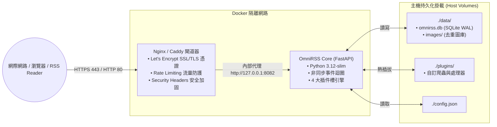

# OmniRSS 伺服器與雲端主機部署維運手冊 (Server & Cloud Deployment Guide)

> **專案名稱**：OmniRSS  
> **版本**：v1.1.0  
> **日期**：2026/10/03  
> **文件路徑**：`docs/DEPLOYMENT.md`

---

## 1. 部署架構總覽 (Architecture Overview)

OmniRSS 設計為極致輕量化的自我託管（Self-Hosted）全能 RSS 服務，採用標準容器化架構，可無縫運行於任何支援 Docker 的環境：

- **適用平台**：
  - **各大雲端 VPS**：DigitalOcean、Hetzner、Linode、AWS EC2、GCP Compute Engine、Oracle Cloud (OCI) 等。
  - **家用伺服器 / NAS / 單板電腦**：Synology DSM、QNAP Container Station、TrueNAS SCALE、Unraid、Proxmox VE、Raspberry Pi 4/5 (ARM64) 等。
- **超低資源佔用**：完整核心進程（含 SQLite WAL、FastAPI 非同步迴圈、定時排程器）記憶體佔用 < **150 MB RAM**，即便是最小規格的 1 vCPU / 1GB RAM 虛擬主機也能長年穩定運行。
- **網路拓撲**：
  - 前端由 **Nginx (或 Caddy)** 負責全主機的 80 / 443 HTTPS 安全門衛，自動處理 SSL/TLS 憑證與靜態資源壓縮。
  - OmniRSS 容器以獨立隔離的 Docker 網路形式執行，宿主機映射內部連線埠至 `127.0.0.1:8082`（可依需求調整），避免外部網路直接存取後端 API。



---

## 2. Docker Compose 部署規格 (`docker-compose.yml`)

在伺服器的 OmniRSS 工作目錄下設定 `docker-compose.yml`：

```yaml
version: '3.8'

services:
  app:
    build: .
    image: omnirss:latest
    container_name: omnirss-app
    restart: unless-stopped
    ports:
      # 將容器內部的 8000 埠映射至宿主機 127.0.0.1:8082 (避免與 8080 或 80 衝突)
      - "127.0.0.1:8082:8000"
    environment:
      - TZ=Asia/Taipei
      - PYTHONUNBUFFERED=1
    volumes:
      - ./config.json:/app/config.json:ro
      - ./data:/app/data
      - ./plugins:/app/plugins
      - ./layouts:/app/layouts
      - ./locales:/app/locales
      - ./logs:/app/logs
    healthcheck:
      test: ["CMD", "python3", "-c", "import urllib.request; urllib.request.urlopen('http://localhost:8000/api/health', timeout=5)"]
      interval: 30s
      timeout: 5s
      retries: 3
```

---

## 3. Nginx 反向代理與 SSL 憑證配置

專案內提供了通用的 Nginx 設定範本 [`nginx/omnirss.conf.example`](../nginx/omnirss.conf.example)。部署步驟如下：

### 步驟 A：設定 HTTP 驗證通道並申請 Certbot SSL 憑證
1. 將範本檔複製至 Nginx 系統目錄：
   ```bash
   sudo cp nginx/omnirss.conf.example /etc/nginx/sites-available/omnirss.conf
   sudo ln -sf /etc/nginx/sites-available/omnirss.conf /etc/nginx/sites-enabled/omnirss.conf
   ```
2. 將 `omnirss.conf` 中的 `rss.yourdomain.com` 替換為您的實際網域名稱。
3. 執行 Certbot 申請免費 Let's Encrypt SSL 憑證：
   ```bash
   sudo certbot --nginx -d rss.yourdomain.com --non-interactive --agree-tos --email your-email@example.com
   ```

### 步驟 B：流量速率與併發放寬調優 (防止 503 卡頓)
為了避免 RSS 閱讀器 (如 NetNewsWire, Reeder) 併發拉取文章或網頁前端載入多張去重圖片時觸發 503 攔截，`omnirss.conf.example` 已進行了優化：
- **一般 API 請求**：`rate=30r/s burst=60 nodelay`。
- **靜態圖片金庫 (`/api/assets/`)**：免除嚴格限流，並注入 `Cache-Control: public, max-age=31536000` 強快取。

---

## 4. SQLite 線上熱備份方案 (`scripts/backup.sh`)

> ⚠️ **關鍵安全守則**：在 SQLite WAL 模式下，直接以 `cp` 複製資料庫檔案可能因正在寫入而導致備份檔損壞。必須使用 SQLite 專屬的 **線上備份 API (`.backup`)**。

建立定時備份腳本 `scripts/backup.sh`：

```bash
#!/bin/bash
# ==============================================================================
# OmniRSS Zero-Downtime SQLite Online Backup Script
# ==============================================================================
set -euo pipefail

BACKUP_DIR="/opt/omnirss/backups"
TIMESTAMP=$(date +"%Y%m%d_%H%M%S")
DB_PATH="/opt/omnirss/data/omnirss.db"
TARGET_BACKUP="${BACKUP_DIR}/omnirss_backup_${TIMESTAMP}.db"

mkdir -p "${BACKUP_DIR}"

echo "[$(date)] Starting SQLite online hot backup..."

# 使用 sqlite3 內建安全線上備份 (完全不鎖定讀寫)
sqlite3 "${DB_PATH}" ".backup '${TARGET_BACKUP}'"

# 壓縮備份檔案
zstd -q --rm "${TARGET_BACKUP}" -o "${TARGET_BACKUP}.zst"

echo "[$(date)] Backup completed: ${TARGET_BACKUP}.zst"

# 自動清除超過 30 天的歷史備份
find "${BACKUP_DIR}" -name "omnirss_backup_*.db.zst" -type f -mtime +30 -delete

echo "[$(date)] Pruning completed. Retained last 30 days."
```

### 設定 Crontab 每日凌晨 03:00 自動備份
```bash
0 3 * * * /opt/omnirss/scripts/backup.sh >> /opt/omnirss/logs/backup.log 2>&1
```

---

## 5. 防火牆安全加固指南 (Firewall & Network Security)

嚴格遵守「最小暴露面」原則，對外僅開放必要的 HTTP/HTTPS 端口，後端服務僅在本機回送介面（Loopback）運作：

### 5.1 通用 Linux 系統防火牆 (UFW)
若伺服器使用 Ubuntu 或 Debian，推薦使用 UFW 進行簡易配置：
```bash
# 預設拒絕入站，允許出站
sudo ufw default deny incoming
sudo ufw default allow outgoing

# 放行 SSH 與 Web
sudo ufw allow 22/tcp comment 'SSH'
sudo ufw allow 80/tcp comment 'HTTP (Let'\''s Encrypt)'
sudo ufw allow 443/tcp comment 'HTTPS'

# 啟用防火牆
sudo ufw enable
```

### 5.2 雲端安全群組 (Security Groups / VCN)
在各大雲端主機管理控制台（AWS Security Group, GCP Firewall Rules, OCI VCN Security List, DigitalOcean Firewall 等）：
- **入站規則 (Inbound)**：
  - `TCP 80` (HTTP) 來源 `0.0.0.0/0`
  - `TCP 443` (HTTPS) 來源 `0.0.0.0/0`
  - `TCP 22` (SSH) 建議僅允許公鑰認證（ed25519 / RSA），並可視情況限定來源 IP
- **內部連接埠隔離 (Port 8082 / SQLite)**：
  - **嚴禁在雲端安全群組中對外開放 8082**，必須僅限本機 `127.0.0.1` 供 Nginx/Caddy 代理。

> [!TIP]
> **常見雲端特例：Oracle Cloud (OCI) Ubuntu 預設 iptables 規則**  
> OCI 的 Ubuntu 官方鏡像檔預設帶有嚴格的本機 `iptables` 規則，即便在 VCN 安全清單開放了 80/443，仍可能被主機內部防火牆阻擋。若使用 OCI，請在 VM 內額外執行：
> ```bash
> sudo iptables -I INPUT 6 -m state --state NEW -p tcp --dport 80 -j ACCEPT
> sudo iptables -I INPUT 6 -m state --state NEW -p tcp --dport 443 -j ACCEPT
> sudo netfilter-persistent save
> ```

---

## 6. 一鍵啟動與維運指令清單

在伺服器工作目錄下完成配置後，即可直接啟動背景守護：

```bash
# 1. 構建並啟動容器 (背景守護模式)
docker-compose up -d --build

# 2. 查看即時滾動日誌 (最新 50 行)
docker-compose logs -f --tail=50

# 3. 檢查核心服務健康狀態
curl http://localhost:8082/api/health

# 4. 平滑重啟或套用外掛變更
docker-compose restart app
```
