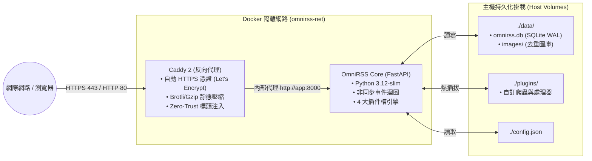

# OmniRSS OCI 雲端部署與維運手冊 (OCI Deployment & Ops Guide)

> **專案名稱**：OmniRSS  
> **版本**：v1.0.0  
> **日期**：2026/09/22  
> **規格書文件路徑**：`docs/DEPLOYMENT_OCI.md`

---

## 1. 部署架構總覽 (Architecture Overview)

OmniRSS 專為 **Oracle Cloud Infrastructure (OCI) Always Free 永久免費方案**（無論是 AMD 1 OCPU/1GB 或 Ampere ARM 4 OCPU/24GB）進行了極致輕量化調優：
- **記憶體佔用**：完整執行緒（含 SQLite WAL、Caddy、FastAPI、排程器）< **150 MB RAM**。
- **網路拓撲**：前端由 **Caddy 2** 負責自動申請 Let's Encrypt SSL/TLS 憑證與靜態資源 Brotli/Gzip 壓縮；後端透過 Docker 內部網路反向代理至 FastAPI 微核心。



---

## 2. Docker Compose 部署規格 (`docker-compose.yml`)

在 OCI 伺服器上的工作目錄下建立 `docker-compose.yml`：

```yaml
version: '3.8'

services:
  caddy:
    image: caddy:2-alpine
    container_name: omnirss-caddy
    restart: unless-stopped
    ports:
      - "80:80"
      - "443:443"
    volumes:
      - ./Caddyfile:/etc/caddy/Caddyfile:ro
      - caddy_data:/data
      - caddy_config:/config
    networks:
      - omnirss-net
    depends_on:
      - app

  app:
    image: ghcr.io/yourusername/omnirss:latest # 或本地 build: .
    container_name: omnirss-app
    restart: unless-stopped
    environment:
      - TZ=Asia/Taipei
      - PYTHONUNBUFFERED=1
    volumes:
      - ./config.json:/app/config.json:ro
      - ./data:/app/data
      - ./plugins:/app/plugins
      - ./logs:/app/logs
    networks:
      - omnirss-net
    healthcheck:
      test: ["CMD", "curl", "-f", "http://localhost:8000/api/health"]
      interval: 30s
      timeout: 5s
      retries: 3

networks:
  omnirss-net:
    driver: bridge

volumes:
  caddy_data:
  caddy_config:
```

---

## 3. Caddy 自動反向代理配置 (`Caddyfile`)

Caddy 具備自動申請與展延 SSL 憑證功能，設定極度簡潔：

```caddy
# 請將 rss.yourdomain.com 替換為您的網域名稱
rss.yourdomain.com {
    encode zstd gzip

    # 安全防護標頭 (Security Headers)
    header {
        X-Content-Type-Options "nosniff"
        X-Frame-Options "SAMEORIGIN"
        Referrer-Policy "strict-origin-when-cross-origin"
        Permissions-Policy "camera=(), microphone=(), geolocation=()"
    }

    # 圖片金庫強快取 (1 年不可變快取)
    @assets path /api/assets/images/*
    header @assets Cache-Control "public, max-age=31536000, immutable"

    # 反向代理至 FastAPI 後端
    reverse_proxy app:8000 {
        header_up Host {host}
        header_up X-Real-IP {remote_host}
        header_up X-Forwarded-Proto {scheme}
    }
}
```

---

## 4. SQLite 線上熱備份方案 (`scripts/backup.sh`)

> ⚠️ **關鍵安全守則**：在 SQLite WAL 模式下，直接以 `cp` 複製資料庫檔案可能因正在寫入而導致備份檔損壞。必須使用 SQLite 專屬的 **線上備份 API (`.backup`)**。

建立定時備份腳本 `scripts/backup.sh`：

```bash
#!/bin/bash
# ==============================================================================
# OmniRSS Zero-Downtime SQLite Online Backup Script
# ==============================================================================
set -euo pipefail

BACKUP_DIR="/opt/omnirss/backups"
TIMESTAMP=$(date +"%Y%m%d_%H%M%S")
DB_PATH="/opt/omnirss/data/omnirss.db"
TARGET_BACKUP="${BACKUP_DIR}/omnirss_backup_${TIMESTAMP}.db"

mkdir -p "${BACKUP_DIR}"

echo "[$(date)] Starting SQLite online hot backup..."

# 使用 sqlite3 內建安全線上備份 (完全不鎖定讀寫)
sqlite3 "${DB_PATH}" ".backup '${TARGET_BACKUP}'"

# 壓縮備份檔案
zstd -q --rm "${TARGET_BACKUP}" -o "${TARGET_BACKUP}.zst"

echo "[$(date)] Backup completed: ${TARGET_BACKUP}.zst"

# 自動清除超過 30 天的歷史備份
find "${BACKUP_DIR}" -name "omnirss_backup_*.db.zst" -type f -mtime +30 -delete

echo "[$(date)] Pruning completed. Retained last 30 days."
```

### 設定 Crontab 每日凌晨 03:00 自動備份
```bash
0 3 * * * /opt/omnirss/scripts/backup.sh >> /opt/omnirss/logs/backup.log 2>&1
```

---

## 5. OCI 安全清單與防火牆加固指南 (Security List & Hardening)

在 Oracle Cloud 控制台嚴格遵守「最小暴露面」原則：
1. **OCI VCN 入站規則 (Ingress Rules)**：
   - 進入 **虛擬雲端網路 (VCN)** ➔ **子網路 (Subnet)** ➔ **安全清單 (Security List)**。
   - **HTTP & HTTPS (80, 443)**：
     - **來源 CIDR**：`0.0.0.0/0`
     - **IP 通訊協定**：`TCP`
     - **目的地連接埠**：`80, 443`
   - **SSH (22)**：
     - **安全建議**：來源限縮為個人家用固定/浮動 IP 區段，或僅允許使用 `ed25519` SSH Key 認證（停用 `PasswordAuthentication`）。
   - **其餘內部服務 (FlareSolverr 8191 / SQLite)**：
     - **嚴禁在 OCI VCN 或 docker-compose 中開放外部 Port**，一律由 Docker Bridge 內部網路通訊。
2. **登入 OCI VM 執行本機 iptables 放行指令**：
   ```bash
   sudo iptables -I INPUT 6 -m state --state NEW -p tcp --dport 80 -j ACCEPT
   sudo iptables -I INPUT 6 -m state --state NEW -p tcp --dport 443 -j ACCEPT
   sudo netfilter-persistent save
   ```

---

## 6. 零停機一鍵啟動指令清單

在 OCI 主機上完成設定後，只需一條指令即可完成常駐守護啟動：

```bash
# 啟動所有容器 (後台守護模式)
docker compose up -d

# 查看即時日誌
docker compose logs -f app

# 檢查健康狀態
curl http://localhost:8000/api/health
```
