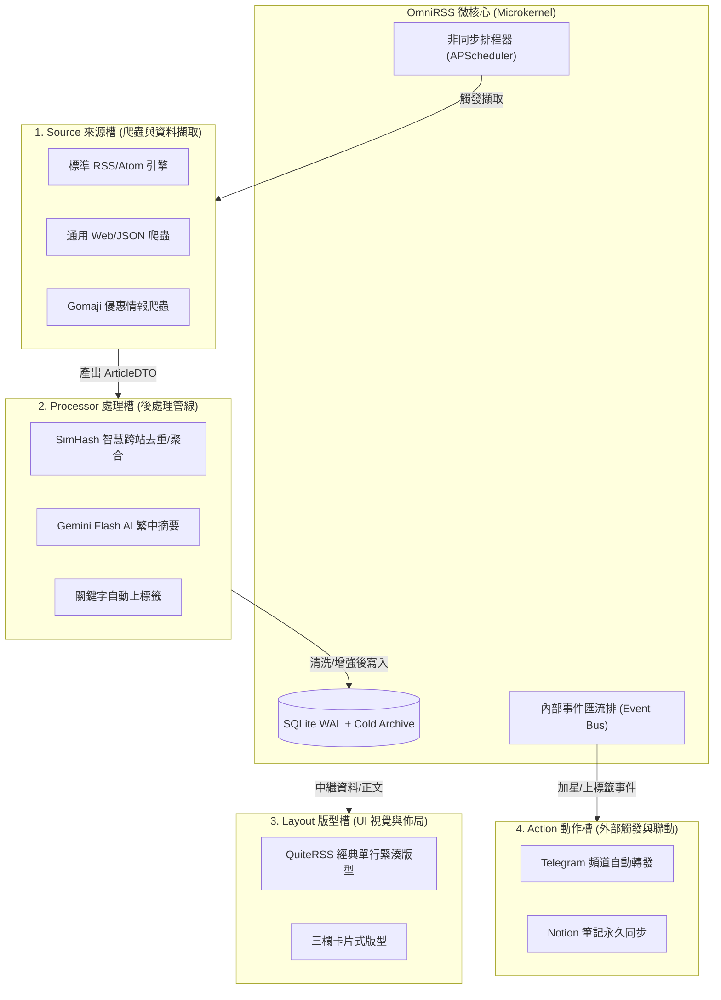
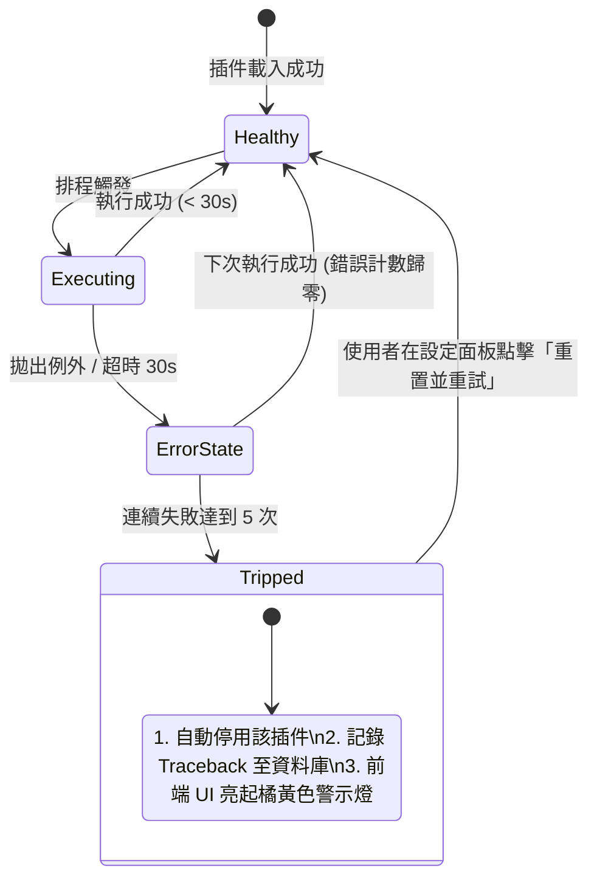

# OmniRSS 插件架構與 SDK 開發規範書 (Plugin System Specification & SDK Contract)

> **專案名稱**：OmniRSS  
> **版本**：v1.0.0 (Context7 & Microkernel 4-Slot Standard)  
> **日期**：2026/09/22  
> **規格書文件路徑**：`docs/PLUGIN_SPEC.md`

---

## 1. 插件槽架構與生命週期 (Plugin Slot Architecture)

OmniRSS 採用**微核心 + 4 大插件槽**架構。微核心（Core）僅負責高併發排程調度、SQLite WAL 儲存與基礎防禦；所有擴充功能均透過標準化的 4 大插件槽實現：



---

## 2. 插件資訊清單標準 (`plugin.json` Manifest Specification)

每個獨立插件均存放於 `plugins/<slot_type>/<plugin_id>/` 目錄下，根目錄必須包含 `plugin.json`：

```json
{
  "$schema": "https://omnirss.local/schemas/plugin-manifest.v1.json",
  "id": "simhash-dedup",
  "name": "SimHash 智慧跨站去重與聚合插件",
  "version": "1.0.0",
  "slot_type": "processor",
  "author": "OmniRSS Core Team",
  "description": "基於 64-bit SimHash 局部敏感雜湊，智慧辨識跨站轉貼、內容農場與改寫洗版文章，支援折疊聚合與自動打標。",
  "entry_point": "plugin:SimHashProcessorPlugin",
  "minimum_omnirss_version": "1.0.0",
  "dependencies": [
    "jieba>=0.42.1"
  ],
  "permissions": [
    "network_access:none",
    "db_read:articles",
    "db_write:article_tags"
  ],
  "default_config": {
    "hamming_distance_threshold": 3,
    "action_mode": "cluster",
    "auto_tag_name": "轉貼報導",
    "auto_tag_color": "#f59e0b"
  },
  "config_schema": {
    "type": "object",
    "properties": {
      "hamming_distance_threshold": {
        "type": "integer",
        "minimum": 1,
        "maximum": 10,
        "title": "漢明距離門檻 (值越小越嚴格，預設 3 代表相似度 > 90%)"
      },
      "action_mode": {
        "type": "string",
        "enum": ["cluster", "tag_only", "mark_read"],
        "title": "偵測到轉貼時的處置模式 (cluster: 折疊聚合; tag_only: 僅打標籤; mark_read: 自動標為已讀)"
      }
    }
  }
}
```

---

## 3. Python SDK Abstract Base Class 定義 (`omnirss/sdk/`)

所有 Python 插件均繼承自 `omnirss.sdk` 提供的標準 ABC 抽象基礎類別：

### 3.1 核心資料傳輸模型 (`omnirss/sdk/models.py`)
```python
from pydantic import BaseModel, Field
from typing import Optional
from datetime import datetime

class ArticleDTO(BaseModel):
    """插件管線間傳遞的文章標準資料傳輸模型 (Pydantic v2)"""
    guid: str = Field(description="文章原始唯一識別碼")
    url: str = Field(description="文章原文連結")
    title: str = Field(description="文章標題")
    author: Optional[str] = Field(default=None, description="作者名稱")
    published_at: datetime = Field(description="文章發布時間 (UTC)")
    
    # 內文資料 (處理插件可逐步豐富化)
    content_html: str = Field(default="", description="原始或清洗後的 HTML 正文")
    content_text: str = Field(default="", description="純文字正文 (已去除 HTML 標籤)")
    snippet: str = Field(default="", description="前 200 字純文字預覽")
    
    # 智慧增強中繼資料
    simhash: Optional[str] = Field(default=None, description="64-bit 語意雜湊指紋")
    duplicate_of_guid: Optional[str] = Field(default=None, description="若為轉貼，指向原始母文章之 guid")
    ai_summary: Optional[str] = Field(default=None, description="AI 產出之條列摘要")
    extra_tags: list[str] = Field(default_factory=list, description="欲附加之標籤名稱清單")
```

---

### 3.2 來源槽基礎類別 (`BaseSourcePlugin`)
```python
from abc import ABC, abstractmethod
from typing import Any
from omnirss.sdk.models import ArticleDTO

class BaseSourcePlugin(ABC):
    """來源插件基礎介面 (專門負責各類客製網站、API、社群活動爬蟲)"""
    
    def __init__(self, plugin_id: str, config: dict[str, Any]):
        self.plugin_id = plugin_id
        self.config = config

    @abstractmethod
    async def fetch(self, feed_url: str, session: Any) -> list[ArticleDTO]:
        """
        執行資料抓取
        
        :param feed_url: 訂閱目標 URL 或自訂目標標識 (例如 "eatgether://taipei/boardgame")
        :param session: 微核心注入的安全 HTTP 客戶端 (內建 Anti-SSRF 防護)
        :return: 抓取並解析完成的 ArticleDTO 清單
        """
        pass
```

---

### 3.3 處理槽基礎類別 (`BaseProcessorPlugin`)
```python
from abc import ABC, abstractmethod
from typing import Any, Optional
from omnirss.sdk.models import ArticleDTO

class BaseProcessorPlugin(ABC):
    """處理插件基礎介面 (在文章入庫前後進行管線加工、過濾、去重、AI 增強)"""
    
    def __init__(self, plugin_id: str, config: dict[str, Any]):
        self.plugin_id = plugin_id
        self.config = config

    @abstractmethod
    async def process(self, article: ArticleDTO) -> Optional[ArticleDTO]:
        """
        處理單篇文章
        
        :param article: 當前處理的文章資料
        :return: 加工豐富化後的 ArticleDTO；若回傳 None，代表該文章被過濾器拋棄不入庫
        """
        pass
```

---

### 3.4 動作槽基礎類別 (`BaseActionPlugin`)
```python
from abc import ABC, abstractmethod
from typing import Any
from omnirss.sdk.models import ArticleDTO

class BaseActionPlugin(ABC):
    """動作插件基礎介面 (響應使用者的收藏 ⭐、打標 🏷️ 等事件，執行外部聯動)"""
    
    def __init__(self, plugin_id: str, config: dict[str, Any]):
        self.plugin_id = plugin_id
        self.config = config

    @abstractmethod
    async def on_article_starred(self, article: ArticleDTO) -> bool:
        """當文章被使用者點擊收藏時觸發"""
        pass

    @abstractmethod
    async def on_article_tagged(self, article: ArticleDTO, tag_name: str) -> bool:
        """當文章被貼上標籤時觸發"""
        pass
```

---

## 4. 官方示範插件與私有擴充規格 (Demonstration & Extension Plugins)

### 4.1 `通用 Web / JSON API 轉 RSS 爬蟲` (`plugins/sources/generic_scraper/`)
* **Slot**: `Source` (公開標準範例)
* **目標**：展示如何將無 RSS 輸出的現代 SPA 網站或 JSON API 轉換為標準 `ArticleDTO` 清單。
* **特性**：提供宣告式 CSS Selector / JSONPath 設定，讓社群無需撰寫 Python 即可訂閱任意網站。
* *(註：私有私密爬蟲如 Eatgether、特定自訂活動爬蟲，建議置於個人私有目錄 `plugins/sources/custom_*/`，微核心會自動動態掃描載入，且已在 `.gitignore` 預設排除，保護私人腳本與網站機制不被公開).*

---

### 4.2 `Gomaji 優惠情報爬蟲` (`plugins/sources/gomaji/`)
* **Slot**: `Source`
* **目標**：爬取 Gomaji 特定餐飲或旅宿特價折價券情報。
* **輸入參數**：`city_id` (例如 1: 台北), `category_id` (例如 2: 美食餐廳), `min_discount_rate` (例如 5 折以下)。
* **輸出**：
  - `title`：`【台北寒舍艾美】平日午晚餐吃到飽雙人券 - 破盤 6.5 折`
  - `url`：`https://www.gomaji.com/deal-p12345`
  - `snippet`：原價、特價、折扣趴數與餐廳位址。

---

### 4.3 `Gemini Flash AI 繁中重點摘要` (`plugins/processors/gemini_summary/`)
* **Slot**: `Processor`
* **目標**：利用 Google `google-genai` 官方 SDK 呼叫 Gemini Flash 模型，為長文產出高密度重點條列。
* **動態模型探測與配額瀑布機制 (Dynamic Model Auto-Discovery & Cascading Fallback)**：
  1. **零寫死版本號 (Zero Hardcoding)**：不再固定綁定特定型號字串（如 1.5 或 2.5），預設設定 `"model": "auto"`。
  2. **自動探測可用模型清單**：初始化時呼叫 `client.models.list()` 取得目前 API Key 支援且具備 Flash 能力的最新模型清單。
  3. **配額自適應瀑布流 (Cascade)**：自動優先選用當前具有可用額度、延遲最低的 Flash 模型；若遇 429 額度耗盡或改版，自動平滑降級至下一個可用 Flash 版本。
  4. **快取保護**：生成之摘要自動持久化於 `archives_cold.ai_summary`，重複瀏覽零 Token 消耗。

---

### 4.4 `SimHash 智慧語意跨站去重與聚合` (`plugins/processors/simhash_dedup/`)
* **Slot**: `Processor`
* **目標**：徹底終結跨站抄襲、轉貼與內容農場洗版問題。
* **演算法核心**：
  1. 使用繁體分詞提取內文關鍵詞與權重（TF-IDF）。
  2. 產出 64-bit 二進位 SimHash 指紋。
  3. 比對近 7 天文章庫指紋庫的漢明距離（Hamming Distance ≤ 3）。
  4. 若判定為轉貼，設定 `article.duplicate_of_guid = parent_guid` 並自動附加 `🏷️ 轉貼` 標籤。

---

## 5. 插件安全隔離、遙測與自動熔斷機制 (Telemetry & Circuit Breaker)

微核心對所有第三方插件實施嚴格的防禦性排程管控：



1. **自訂與防衛性雙層逾時機制 (Custom & Defensive Timeout Clamping)**：
   - **外掛宣告自訂秒數**：外掛可在 `plugin.json` 宣告 `"timeout_seconds": 30`（預設: 15 秒）。
   - **全域硬上限天花板 (Global Hard Cap)**：伺服器全域強制設定上限 `GLOBAL_MAX_PLUGIN_TIMEOUT_SEC = 45` 秒，任何外掛皆不得超越。
   - **防衛性邊界鉗制 (Defensive Value Clamping)**：
     - 微核心透過數學公式防禦負數（如 `-30` 秒）、零或畸形輸入：
       $$\text{effective\_timeout} = \max(1, \min(\text{int}(\text{manifest\_declared}), 45))$$
     - 若外掛宣告 $\le 0$ 或格式錯誤，核心自動防禦性回退為預設值 15 秒並記錄警告 Log，杜絕系統因異常秒數當機。
     - 執行時包裹 `asyncio.wait_for(task, timeout=effective_timeout)`，超時立即安全中斷協程。
2. **例外隔離 (Exception Isolation)**：插件崩潰僅影響該單一任務，微核心捕捉所有 `Exception` 並寫入 `plugins_telemetry` 表，絕不拖垮主系統。
3. **自動熔斷保護 (Circuit Breaker)**：連續發生 5 次錯誤（如下游網站反爬改版拋出 403/500 或連續超時）時，系統自動將該插件標記為 `is_tripped = 1` 並暫停排程，避免無效耗盡 CPU 與伺服器頻寬。

---

## 6. 外掛設定階梯繼承、衝突防禦與版本劫持防護 (Config Cascade & Anti-Hijacking)

### 6.1 雙層外掛配置階梯繼承 (Namespaced Config Cascade)
為了讓單一外掛能同時支援「全站共用」與「個人獨立自備金鑰 (BYOK)」，外掛執行時的最終生效設定（Effective Config）遵循以下優先權覆蓋原則：

$$\text{EffectiveConfig} = \text{ManifestDefault} \oplus \text{GlobalConfig} \oplus \text{UserConfig}$$

```python
# SDK 運行時自動合併，外掛開發者 0 額外代碼負擔：
class BaseProcessorPlugin:
    def get_effective_config(self, user_id: int) -> dict:
        manifest_default = self.manifest.get("default_config", {})
        global_config = db.get_global_plugin_config(self.plugin_id)
        user_config = db.get_user_plugin_config(user_id, self.plugin_id)
        return {**manifest_default, **global_config, **user_config}
```

### 6.2 作者命名空間規範 (Author Namespacing: `author/plugin_id`)
* **官方外掛標準**：`"id": "omnirss/gemini-summary"`
* **社群外掛標準**：`"id": "john/gemini-summary"`, `"id": "alice/gemini-summary"`
* **效果**：不同開發者的同名外掛在系統內部完全獨立，可同時安裝、各自獨立運作，從根本杜絕撞名。

### 6.3 防禦版本 9999 惡意劫持的三大鐵律 (Anti-Version-Hijacking Rules)
1. **目錄路徑綁定 (Path Binding)**：
   - 若不同資料夾嘗試宣告已存在的 `plugin_id`，微核心一律判定為「非法冒名衝突 (Identity Spoofing)」，直接拒絕載入並在 UI 顯示衝突警示。
2. **作者與數位指紋校驗 (Author Integrity)**：
   - 初次安裝記錄作者與代碼 SHA-256 雜湊，防止未經授權的代碼偷換。
3. **絕無靜默自動升級 (No Silent Upgrade)**：
   - 即使版本號寫為 `9999.0.0`，系統**絕不自動覆蓋代碼**，必須由超級管理員在 Web UI 手動檢閱變更並主動點擊「授權升級」方可生效。
