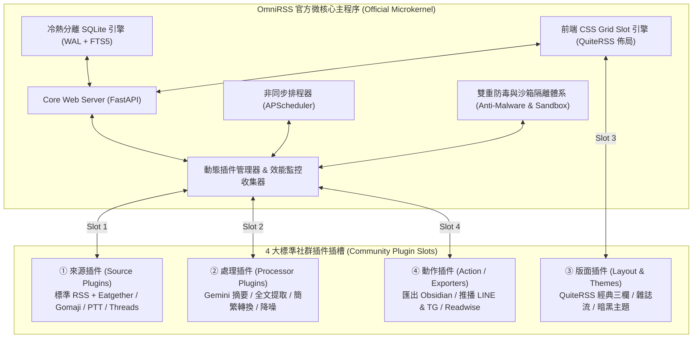
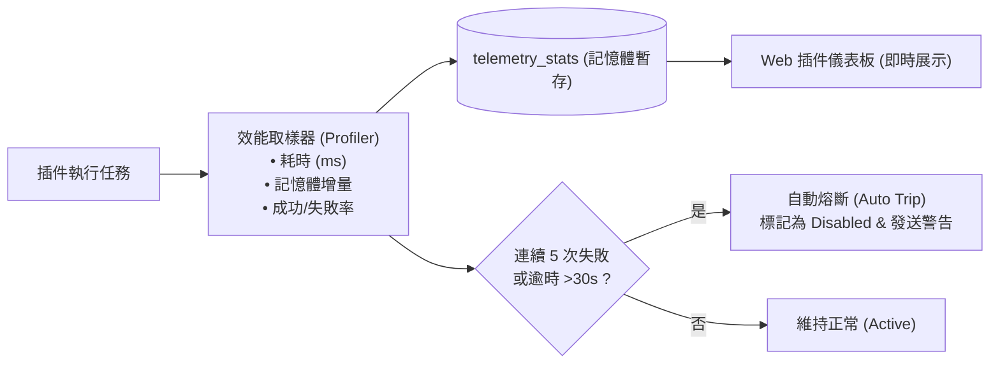

# OmniRSS 開源微核心系統架構規格書 (Open Source System Specification)

> **專案名稱**：OmniRSS (開源微核心 RSS 智慧閱讀器、自動全文提取與擴充插件生態平台)  
> **版本**：v1.2.0 (Plugin Observability & Dual Sandbox Edition)  
> **日期**：2026/09/25  
> **狀態**：已完成 / 生產就緒 (Completed & Production-Ready)  
> **開源授權**：MIT License  
> **規格書文件路徑**：`docs/SPEC.md`

---

## 1. 專案願景與開源架構哲學 (Vision & Microkernel Philosophy)

OmniRSS 是專為 20 年以上資深 RSS 重度使用者打造的現代化開源平替方案。我們遵循 **「微核心 (Microkernel) + 外掛插件生態系 (Plugin Ecosystem)」** 的設計哲學：

> **主程序只做裁判、不做球員**：官方團隊只專注維護極致輕量、穩定抗肥大的「微核心引擎」與「插槽協定」；所有客製化網站爬蟲、AI 加工模型、排版主題與外部匯出動作，全部開放給社群以插件形式隨插即用（Drop-in）。



---

## 2. 技術堆疊選型 (Technology Stack)

| 層級 (Layer) | 選用技術 | 選型原因與開源優勢 |
| :--- | :--- | :--- |
| **後端核心** | **Python 3.12+ (FastAPI + Asyncio)** | 高效能非同步 API、極速開發社群外掛、型別提示完整 (Pydantic) |
| **外掛 SDK** | **`omnirss.sdk` (標準 DTO 與 Hook 介面)** | 提供社群開發者 10 行代碼即可上手的抽象類別與宣告式 Manifest |
| **排程引擎** | **APScheduler + Asyncio HTTP Client** | 支援動態熱註冊 Cron Job、內建 ETag / 304 條件式快取請求 |
| **儲存底座** | **SQLite 3 (WAL 模式 + FTS5 全文索引)** | 零配置、單檔可攜、毫秒級全文檢索、冷熱資料庫解耦、抗卡頓 |
| **圖庫去重** | **Content-Addressable Storage (SHA-256 WebP)** | 實體圖檔自動去重轉檔，資料庫僅存路徑，磁碟節省 60% |
| **防毒與沙箱** | **Zero-Script CSP + nh3 Sanitizer + Anti-SSRF** | 徹底杜絕網頁木馬與惡意腳本，隔離外掛執行環境與內網請求 |
| **前端介面** | **Vanilla ES6+ JS / CSS Grid Slots / PWA** | 零 Node.js 構建依賴，極速載入，支援 QuiteRSS 鍵盤流與動態版面 |
| **部署開源** | **Docker & Docker Compose (相容 OCI / VPS / NAS)** | 一鍵 `docker compose up -d` 30 秒快速啟動 |

---

## 3. 四大標準插件插槽規範 (The 4 Official Plugin Slots)

任何社群開發者只需在專案的 `plugins/` 或 `layouts/` 目錄新增一個獨立資料夾，即可完成擴充。

### 3.1 宣告式 Manifest 規範 (`plugin.json`)
每個外掛目錄必須具備 `plugin.json`：
```json
{
  "id": "omnirss-plugin-eatgether",
  "name": "Eatgether 聚會來源外掛",
  "version": "1.0.0",
  "author": "TechLead",
  "type": "source",
  "description": "自動抓取 Eatgether 聚會活動，產出結構化圖文文章",
  "entrypoint": "main:EatgetherPlugin",
  "permissions": ["network:http"],
  "settings_schema": {
    "city": { "type": "string", "default": "台北市", "label": "預設抓取城市" },
    "interval_minutes": { "type": "integer", "default": 30, "label": "更新頻率(分)" }
  }
}
```

---

### 3.2 插槽一：來源插件 (Source Plugin)
- **目錄**：`plugins/sources/{plugin_id}/`
- **職責**：將非標準 RSS 網站（或需客製 Token/Cookie 的來源）轉換為標準 `ArticleDTO`。
- **Python 標準實作範例**：
  ```python
  from omnirss.sdk import BaseSourcePlugin, ArticleDTO
  
  class EatgetherPlugin(BaseSourcePlugin):
      async def fetch(self, config: dict) -> list[ArticleDTO]:
          response = await self.http_get(f"https://api.eatgether.com/meetups?city={config['city']}")
          return [
              ArticleDTO(
                  uid=f"eg_{item['id']}",
                  title=f"[{item['payment']}] {item['title']}",
                  link=item['share_url'],
                  content_html=item['description'],
                  author=item['host_name'],
                  published_at=item['created_at'],
                  cover_image_url=item.get('cover_image')
              )
              for item in response.json().get('data', [])
          ]
  ```

---

### 3.3 插槽二：處理插件 (Processor Plugin)
- **目錄**：`plugins/processors/{plugin_id}/`
- **職責**：文章入庫前後的加工管線（如 AI 重點摘要、簡轉繁、自動全文提取、商業廣告過濾）。
- **Python 標準實作範例 (Gemini AI 摘要)**：
  ```python
  from omnirss.sdk import BaseProcessorPlugin, ArticleDTO
  
  class GeminiSummaryPlugin(BaseProcessorPlugin):
      async def process(self, article: ArticleDTO, config: dict) -> ArticleDTO:
          if article.is_starred or config.get("auto_summary_all"):
              summary_text = await self.call_gemini_flash(article.content_text)
              article.ai_summary = summary_text
              article.tags.append("AI 摘要")
          return article
  ```

---

### 3.4 插槽三：版面與主題插件 (Layout & Theme Plugin)
- **目錄**：`layouts/{layout_id}.json` 與 `web/themes/{theme_id}.css`
- **職責**：定義前端 CSS Grid Slot 區塊排列與視覺樣式。
- **QuiteRSS 經典三欄設定檔範例 (`layouts/quiterss_classic.json`)**：
  ```json
  {
    "id": "quiterss_classic",
    "name": "QuiteRSS 經典三欄",
    "author": "OmniRSS Core",
    "version": "1.0",
    "grid": {
      "areas": "\"tree list reader\" 1fr / 260px 380px 1fr",
      "gap": "1px"
    },
    "slots": {
      "tree": { "component": "SubscriptionTree", "title": "訂閱分類樹" },
      "list": { "component": "ArticleList", "title": "文章列表" },
      "reader": { "component": "ArticleReader", "title": "內容閱讀器" },
      "ai_drawer": { "component": "AISummaryDrawer", "dock": "inside_reader" }
    }
  }
  ```

---

### 3.5 插槽四：動作與匯出插件 (Action / Exporter Plugin)
- **目錄**：`plugins/actions/{plugin_id}/`
- **職責**：監聽使用者行為（加星號收藏、套用標籤、點擊匯出按鈕），觸發外部系統連動。
- **範例應用**：
  - **Obsidian 同步**：收藏文章時，自動在指定目錄生成 Markdown 與下載圖片。
  - **Telegram / LINE 通知**：觸發高優先級規則時，即時推播短訊。

---

## 4. 插件管理中心與效能可觀測性 (Plugin Center & Observability)

微核心提供專屬的「外掛管理與效能監控儀表板 (Plugin Dashboard)」，具備開關控制、遙測數據與自動熔斷保護：



### 4.1 插件儀表板功能規範
1. **即時開關 (Hot Toggle)**：在 Web 介面一鍵切換 `ON / OFF`，系統即時動態掛載或卸載排程，免重新啟動主程式。
2. **效能指標 (Telemetry Profiling)**：
   - **單次平均耗時 (Average Latency)**：毫秒 (ms) 計時，標記黃燈（>2,000ms）或紅燈（>10,000ms）。
   - **記憶體佔用 (Memory Footprint)**：監控外掛執行期間的記憶體變化。
   - **抓取成功率與文章計數**：紀錄每次執行的產出篇數與 HTTP 狀態碼。
3. **錯誤排查日誌 (Error Traceback Viewer)**：
   - 點擊「查看錯誤」可直接在前端展開最後一次報錯的完整 Python Exception 堆疊追蹤，便於社群開發者與使用者即時除錯。
4. **自動熔斷機制 (Circuit Breaker)**：
   - 當單一插件連續崩潰或超時達門檻（預設 5 次），主程式自動將其狀態標記為 `Tripped (熔斷)`，暫停排程並發出介面提醒，防止無效重試消耗 OCI 資源。

---

## 5. 雙重防毒與沙箱隔離機制 (Dual-Layer Anti-Malware & Sandbox Defense)

針對外部網站的「木馬/惡意腳本」與社群插件的「惡意代碼」，系統建構兩大縱深防禦戰場：

```mermaid
flowchart TD
    subgraph Layer1["戰場 1: 外部網頁威脅防禦 (Webpage Malware & XSS)"]
        RawHTML["外部網站原始 HTML (含潛在木馬/腳本)"] --> CSPGuard["1. CSP (Content Security Policy)<br>嚴格 script-src 'none'"]
        CSPGuard --> DeFanger["2. nh3 靜態拔牙脫毒 (De-fanging)<br>連根拔除 script / object / iframe / on* 事件"]
        DeFanger --> SandboxedIframe["3. iframe sandbox 隔離渲染<br>限制自動下載與惡意彈窗"]
        SandboxedIframe --> SafeRead["純淨靜態圖文 (木馬完全失去執行能力)"]
    end

    subgraph Layer2["戰場 2: 第三方外掛代碼隔離 (Plugin Execution Sandbox)"]
        PluginCode["社群開發的 Python 外掛"] --> TimeoutTrap["1. 30 秒超時硬中斷 (Timeout Guard)"]
        TimeoutTrap --> FaultTrap["2. 獨立例外捕捉 (Fault Trap - 核心零崩潰)"]
        FaultTrap --> SSRFFirewall["3. 核心 Anti-SSRF 防火牆 (阻斷內網與雲端 Metadata)"]
        SSRFFirewall --> PermCheck["4. 宣告式權限比對 (Manifest Permission Check)"]
    end
```



### 5.1 戰場 1：外部網站防毒與防木馬（Zero-Script Policy）
- **核心原理**：網頁木馬與挖礦程式必須透過「執行 JavaScript」或「觸發瀏覽器漏洞下載執行檔」才能生效。
- **OmniRSS 免疫三道防線**：
  1. **零 JavaScript 執行 (Zero Script Execution)**：後端 API 響應強制附帶安全標頭：
     ```http
     Content-Security-Policy: default-src 'self'; script-src 'none'; style-src 'self' 'unsafe-inline'; img-src * data:; media-src *;
     ```
  2. **靜態化「拔牙脫毒」(De-fanging with `nh3`)**：所有外部文章正文強制過濾，清除 `<script>`, `<object>`, `<embed>`, `<iframe>`, `onload=`, `onerror=`, `javascript:` 偽協議，只保留純排版標籤。**即便原網站被掛馬，在 OmniRSS 內也只是一張無法動彈的死文字報紙。**
  3. **內嵌預覽沙箱 (`<iframe sandbox>`)**：切換至原網頁預覽模式時，強制賦予 `sandbox="allow-same-origin allow-popups"`，徹底禁止背景靜默下載檔案。

### 5.2 戰場 2：社群外掛與爬蟲網路隔離（Plugin & Anti-SSRF Sandbox）
1. **故障例外捕捉 (Fault Isolation)**：插件崩潰時捕捉 Exception 並歸檔日誌，主程式核心不受任何干擾。
2. **四重防禦 Anti-SSRF 網路網關 (The 4-Layer Anti-SSRF Gateway)**：
   所有 RSS 抓取與外掛發出的 HTTP 請求，強制通過核心網路網關，徹底杜絕網址偽裝與 OCI 雲端憑證竊取：
   - **層級 ①：強制 DNS 解析真實 IP (Deep IP Inspection)**：
     - 不論輸入的網域名稱如何包裝（如 `evil.com` 指向私有 IP），連線前強制透過 `socket.getaddrinfo()` 解析所有背後 A/AAAA 記錄。
     - 透過 `ipaddress` 嚴格比對：凡命中私有網段（`127.0.0.0/8`、`10.0.0.0/8`、`172.16.0.0/12`、`192.168.0.0/16`）、Link-Local（`169.254.0.0/16`）或 **OCI 元數據專用 IP (`169.254.169.254`)**，立即拒絕連線！
   - **層級 ②：HTTP 301/302 重導向逐跳重審 (Strict Redirect Hook)**：
     - 停用 HTTP Client 自動無條件 Follow Redirect，改以 Event Hook 攔截每一跳 `Location`，重導向網址必須重新通過完整 Anti-SSRF 檢驗，杜絕「合法入口 ➔ 302 偷渡內網」。
   - **層級 ③：連線 IP 固定綁定 (Socket Pinning 防 DNS Rebinding)**：
     - 檢查通過後直接使用驗證過的實體 IP 建立 TCP 連線（`connect_to=verified_ip`），禁止二次 DNS 查詢，徹底免疫 TTL=0 的 DNS 重綁定時間差攻擊。
   - **層級 ④：進制與變種標準化 (IP Canonical Normalization)**：
     - 自動規格化十進制 (`2130706433`)、八進制 (`0177.0.0.1`) 與 IPv4-mapped IPv6 (`[::ffff:127.0.0.1]`) 等混淆表示法。
3. **自訂雙層超時機制 (Defensive Timeout Clamping)**：外掛自訂秒數（預設 15s），受全域天花板 45s 硬上限與防負數數學邊界鉗制。

---

## 6. 資料儲存與冷熱分離架構 (Storage Architecture)

```text
OmniRSS 儲存目錄結構:
data/
├── feeds_hot.db       # [熱庫] 近 30~90 天文章中繼資料、未讀狀態、標籤關聯 (WAL 模式)
├── archive_cold.db    # [冷庫] 永久收藏與星號文章正文 (zstd 壓縮存檔)
├── fts5_index.db      # [索引] 虛擬全文檢索倒排索引 (毫秒級搜尋)
└── images/            # [圖庫] SHA-256 去重圖檔 (WebP 格式)
    └── a1/
        └── b2/
            └── a1b2c3d4...webp
```

- **熱資料庫自動治理**：背景排程每日執行 `PRAGMA incremental_vacuum`，自動剔除已讀且未收藏的過期中繼資料，維持熱庫體積 `< 50MB`。
- **圖庫去重**：同網址或同雜湊之圖片只儲存一份，正文圖片自動轉寫為 `/api/images/{hash}`。

---

## 7. 開源專案目錄結構 (Open Source Project Layout)

專案落地位址：`02.Projects 專案資料/07.PythonApps/OmniRSS/`

```text
├── locales/                    # 🌐 多國語系字典檔 (i18n Dictionaries)
│   ├── zh-TW.json              # 繁體中文語系 (預設)
│   ├── en-US.json              # English 語系
│   └── ja-JP.json              # 日本語系 (可擴充)
├── omnirss/                    # 官方核心套件 (Core Package)
│   ├── __init__.py
│   ├── main.py                 # FastAPI 服務啟動進入點 (< 60 行)
│   ├── sdk/                    # 官方外掛開發 SDK (供社群引用，零內部依賴)
│   │   ├── __init__.py
│   │   ├── models.py           # ArticleDTO, FeedDTO, MediaManifestDTO (Pydantic)
│   │   ├── base_plugin.py      # 4 大插槽抽象類別 (BaseSourcePlugin, BaseProcessor...)
│   │   └── context.py          # 注入外掛的安全 HTTP Session 與 Logger
│   ├── core/                   # 核心領域層 (純商業邏輯與基建，零 Web 依賴)
│   │   ├── config.py           # 設定管理 (Pydantic BaseSettings, UPPERCASE)
│   │   ├── database.py         # SQLite WAL 連線池、PRAGMA 調優、DDL 遷移
│   │   ├── security.py         # Anti-SSRF 網關、nh3 脫毒、Argon2id、常數比對
│   │   ├── plugin_manager.py   # 動態插件加載器、雙層沙箱、三層外掛設定覆蓋
│   │   ├── circuit_breaker.py  # 逾時鉗制 (1~45s)、效能取樣 (Telemetry) 與 5 振熔斷
│   │   ├── crawler_engine.py   # HTTP 304 條件快取、Auto-Referer、三階降級協同
│   │   ├── rule_engine.py      # QuiteRSS 條件過濾器 (AND/OR/Regex) 與動作分發
│   │   ├── image_vault.py      # SHA-256 全域圖床去重與 WebP 轉碼冷存
│   │   ├── backup_engine.py    # OPML 2.0 雙向匯出入、個人設定脫敏備份
│   │   ├── i18n.py             # 後端多國語系翻譯器 (RFC 7807 錯誤與 Log 本地化)
│   │   └── scheduler.py        # APScheduler 非同步排程器
│   ├── api/                    # HTTP 介面層 (薄控制器與 FastAPI 路由分流)
│   │   ├── dependencies.py     # 鑑權注入 (JWT / X-API-Key)、Rate Limiter
│   │   ├── schemas.py          # API Request/Response DTO (Pydantic v2)
│   │   └── routers/            # 專用領域路由分拆
│   │       ├── auth_router.py
│   │       ├── feeds_router.py
│   │       ├── articles_router.py
│   │       ├── rules_router.py
│   │       ├── plugins_router.py
│   │       ├── edge_router.py
│   │       └── backup_router.py
│   └── web/                    # 前端介面層 (模組化 ES6 + CSS 零件化，零構建依賴)
│       ├── index.html          # 單一頁面 Shell (語意化 HTML5)
│       ├── manifest.webmanifest# PWA 安裝資訊清單
│       ├── sw.js               # Service Worker (離線快取與 PWA 註冊)
│       ├── css/                # 零件化樣式
│       │   ├── tokens.css      # 色彩變數、24px 密度定義、QuiteRSS 主題
│       │   ├── layout.css      # CSS Grid 佈局、拖曳 Splitter 樣式
│       │   ├── tree.css        # 左側目錄樹與未讀數徽章
│       │   ├── list.css        # 中間 24px 極限單行表格、[ ⊞ ] 欄位勾選器
│       │   ├── reader.css      # 右側/下方閱讀窗排版與影音嵌入
│       │   └── modals.css      # 偏好設定、過濾規則編輯器、外掛中心彈窗
│       └── js/                 # 現代原生 ES6 模組 (按職責拆分)
│           ├── app.js          # 前端啟動進入點與 EventBus 總線
│           ├── state.js        # 響應式狀態管理
│           ├── api_client.js   # Fetch 封裝、自動注入 Token、錯誤處理
│           ├── i18n.js         # 前端多國語系引擎 (無重載即時切換)
│           ├── keybindings.js  # QuiteRSS 鍵盤流監聽器 (j/k, v, m, s, Shift+A)
│           └── components/     # 獨立 UI 元件 (Tree, List, Reader, Splitter...)
├── plugins/                    # 外掛目錄 (隨插即用 Drop-in)
│   ├── sources/                # 來源插件
│   ├── processors/             # 處理插件
│   └── actions/                # 動作插件
├── layouts/                    # 前端版面模版 (quiterss_compact.json...)
├── data/                       # 運行資料目錄 (.gitignore)
├── config.example.json         # 設定檔範本
├── requirements.txt            # Python 依賴清單
├── Dockerfile                  # 容器映像構建檔
├── docker-compose.yml          # 一鍵開源部署檔
├── LICENSE                     # MIT License
└── README.md                   # 開源專案說明門戶
```

---

## 8. 開發里程碑與實作計畫 (Milestones)

- [ ] **Phase 1: 微核心底座、Plugin SDK 與安全防護**
  - 建置 `omnirss.sdk`（定義 `ArticleDTO`、`PluginManifest`、`BasePlugin` 抽象類別）。
  - 建置 `PluginManager` & `telemetry.py`（動態加載、效能監控、超時限制、自動熔斷）。
  - 建置 `security.py`（Anti-SSRF 網路網關 + `nh3` HTML 脫毒清洗器 + Zero-Script CSP 標頭）。
  - 建置 `database.py`（SQLite WAL 冷熱分離 + 圖片 SHA-256 WebP 去重儲存）。
- [ ] **Phase 2: 核心排程器與標準 RSS 爬蟲**
  - APScheduler 非同步排程 + ETag / 304 條件請求。
- [ ] **Phase 3: 官方範例插件移植與驗證**
  - 來源外掛：移植 `Eatgether` 與 `Gomaji`（驗證自訂來源能順暢進庫）。
  - 處理外掛：實作 `Gemini Flash AI 摘要` 插件。
- [ ] **Phase 4: 前端 Slot 引擎、QuiteRSS 三欄與插件儀表板**
  - CSS Grid 插槽渲染器（`SlotEngine`）+ 鍵盤流快捷鍵（`J`/`K`/`Space`/`M`/`S`/`A`/`T`）。
  - 前端「插件管理中心 (Plugin Center)」面板（即時開關、耗時圖表、錯誤 Log 展開）。
- [ ] **Phase 5: 開源生態拋光與 Docker 一鍵部署**
  - 撰寫 `CONTRIBUTING.md` 外掛開發範例教學 + 撰寫 `docker-compose.yml` + 多平台相容測試。
